|===
| *Warning:** This document is a working document* The outline of the documentation is colored in purple*Process:** Some sections of the document are assigned to certain people* The people are working on authoring the content* Once the content of a section is ready, please ping Mario, Robert and Stevan to review* When a section is reviewed, ping docs team for publication* Once the section is published, put an indicator in front of the section with a link             
|===


= Eclipse Che 7
:toc: macro


Documentation Outline


* *Overview*
  ** Introduction
    *** What is Eclipse Che
    *** Architecture
    *** Features and benefits


* *Setup Eclipse Che*
  ** P1 Get started with already installed Che on che.openshift.io


The easiest way to get started with Eclipse Che, is by using the free online version that is hosted on che.openshift.io.


*Create your account* onhttps://che.openshift.io[ che.openshift.io] and gets 3GB RAM for free to code in the cloud.


*Use the following pre-configured developer environment: https://che.openshift.io/f?id=factoryvbwekkducozn3jsn* [https://che.openshift.io/f?id=factoryvbwekkducozn3jsn] 


Note: This is using the Che Factories. They are a unique way to share a ready-to-code developer environment that is running in the cloud. You can learn more about that on the following documentation. [TODO: link]


*Or create a new workspace* and select "Che 7" stack.

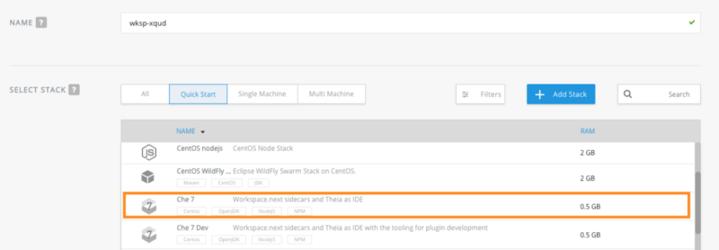


  ** P1 Explain how to install Che 
    *** Include links to installation guidelines


* *Get Started*
  **  P1 Intro Videos
  **  P1 Discover Eclipse Che
    *** Page with a tutorial to follow to discover all capabilities of Eclipse Che
      **** Share with a Factory
  ** Tips and Tricks
    *** List of useful tips on better using Che
      **** Command palette
      **** Terminal
      **** ...
  ** Eclipse Che Dashboard
    *** Introduction to Eclipse Che dashboard
      **** Navigation, left sidebar
    *** Overview of the capabilities
      **** List of workspaces
        ***** See details of a workspace
      **** List of Factories
      **** Configuration Option
  ** Eclipse Che IDE
    *** User Interface
    *** Key bindings (link to doc on keybindings)
* *User How-To* 
  ** P1 Create a workspace from code sample
  ** P1 Create a workspace by import source code of your project
  ** Use Eclipse Che for developing container applications
    *** Creating a workspace by using your runtime containers
    *** How to add another container to an existing workspace
    *** Creating a workspace by using K8S resource definitions
  ** Create a workspace using DevFile
  ** How to propose a PR from Eclipse Che to github
  ** How to review a PR from github on Eclipse Che
  ** How to get a Che workspace using Browser Extension
  ** How to control a workspace using Che CLI
  ** How to configure plugins


devPlugins can be added by user from Eclipse Che dashboard. In first, choose the workspace detail. 

*


Then, open a plugins tab and select needed editor and plugins which are in the plugin registry 

*


After adding, we can see the next workspace config:

*
+


In other hand plugins/editors can be added from the workspace config tab, by adding URLs in the needed fields. Let's add an editor and a plugin  from the existing official repository by URLs.  So, it is the simplest way to add a new custom plugin from any public resource.


+
*


Important notes:

* For adding a link for the custom plugin/editor -  get the URL for raw meta.yaml of the plugin/editor, transform it to the needed format (change string ending from '/version/meta.yaml' to ':version' ). Add this link as a plugin/editor to workspace config.


+

+
Apply changes. Then, Eclipse IDE editor will be loading:


  ** *


* *Che Workspaces*
  **  P1 Overview
    *** Explain the terminology and the components
    *** Diagram
    *** Workspace Definition - DevFile


Eclipse Che provides developer workspaces with everything needed to a developer to code, build, test, run and debug his applications. To allow that, the developer workspaces are providing 4 main components:

* *Project(s) source code:* the sources of the project
* *Browser based IDE* : the web based IDE that is packaged by default in the workspace.
* *Tools dependencies* : the different dependencies that are needed for the developer to work on the project.
* *Application runtime(s)* : the replica of the environement where the application is running on production.


Eclipse Che workspaces are defined by Kubernetes pods. Everything running in a Che developer workspaces is running inside of containers and is accessible from the embeded browser based IDE. Because developer workspaces are containerized they are highly portable and because they only need a browser to be accessed, they are easily shareable.


Che workspaces are defined by a `devfile`. The `devfile` is the definition of everything that is used in the developer workspaces. It defines the different projects, the browser IDE to use, the different tools (and plugins) as well as linking to the definition of your application runtime (K8S or OpenShift YAML). This file can be versioned with the source code and easily use to instanciate workspaces on demand.


*Features and Benefits:*


|===
| *Features*                                                                                                       | *Traditional IDEs Workspaces*                                                                                    | *Che Workspaces*                                                                                                  
| *Require configuration and installation*                                                                         | Yes.                                                                                                             | No.                                                                                                               
| *Embed tools*                                                                                                    | Partial.IDE plugins need configuration. Dependencies need installation and configuration.Ex: JDK, Maven, Node... | Yes.Plugins are providing their dependencies.                                                                     
| *Provide application runtime*                                                                                    | No. Developers have to manage that separately.                                                                   | Yes.Application runtime is replicated in the workspace.                                                           
| *Shareable*                                                                                                      | No.Or not easily                                                                                                 | Yes. Developer workspace are shareable with a URL.                                                                
| *Versionable*                                                                                                    | No                                                                                                               | Yes.Devfile is living with the project source code.                                                               
| *Accessible from anywhere*                                                                                       | No. Installation is needed                                                                                       | Yes.Only requires a browser.                                                                                      
|===


Diagram:


Devfile: 

* Put an example
* Put diagram from repo
* 


* 


With traditional IDEs, developers would create a workspace per project on their laptop. When a developper is starting to work on a new project, he would spend few time (or days) to setup his environment. For instance a Java developer would setup Maven, the JDK, the database. He would clone the Git projects and so on. This is his workspace. He would do that once and would maintain and change it by the time. He would create Git branches to switch from one task/issue to another which can be painful. Eventually, he would get a new laptop and would have to setup everything again.


Eclipse Che uses `devfile` to define everything in a developer workspaces: the projects to clone, the preconfigured commands, the tools that you need but also your application runtime definition. When you create a workspace, Che uses that definition to can automagically setup everything for youu. It means that creating a new workspace is easy once you have define your devfile. When creating a workspace, Che would and instantiate  all the containers for your tools, your application runtimes and mounts some filesystem volume to provide your source code in there. 


Devfile can be versioned with your source code repository. When you’ll have to get a workspace to fix an old maintenance branch, you’ll have the definition of the workspace with the tools and the exact dependencies to come back working on that old branch.


You can also create several workspaces from the same devfile for free. It means that you could create a new workspace each time you work on a new task. It means that you could easily switch from one task to another without any effort, without having to switch branch in Git and do any `git squash` and so on. 


It also means that you could share this devfile, the way to create a workspace, with other developers. New developers would be ready to start working on a project instantly. devfiles could evolves by the time and because it is written in a single yaml file, it can be versioned in your SCM and could track the changes. So adding a new git project or a new command to your workspace is piece of cake and all the developers would get the benefits of it.

Once the workspace is generated, Che maintains the `devfile` keeps  the configuration up-tdate with the tools you are using from the workspace: in a `workspace configuration`. A json file that contains

* Projects of the workspace (path, git location, branch, etc …),
* Commands to perform daily tasks (build, run, test, debug, …),
* Runtime environment (containers images to run your app)
* devPlugins that are the tools, IDE features and helpers, the developer would use in his workspace (Git, Java support, Sonarlint, Pull Request, etc …)


  **  P1 Workspace Definition
    *** Runtimes
    *** Exposing Services
    *** Volumes
    *** Environment Variables
    *** Projects
    *** Recipe
  ** Open a Shell into a Che Workspace
  ** Workspace Troubleshooting	


* *Che IDE Basics*
  ** Overview
    *** Navigate the Che UI
  ** Files and Projects
  ** Editor and Code Assistance  
  ** Key Bindings
  ** Search
  ** Commands
  ** Debugging
  ** Testing
  ** Version Control
  ** Integrated Terminal
  ** Languages
  ** SSH


* *Collaborative Development*
  ** Overview
    *** Diagram, showing the different options
  ** Portable Developer Workspace
    *** Authoring a DevFile
    *** Sharing with Factories
      **** What are Factories
      **** Factories capabilities/options
        ***** Additional actions on factory load
          ****** Execute command
          ****** Open editor in position
        ***** Sparse Checkout
        ***** Welcome Panel (deprecated)
        ***** Pull request 
      **** Creating a Factory
        ***** Creating factory via dashboard
      **** Badging repository
  ** Sharing Access to a Workspace
  ** Managing Developer Teams
    *** Organization docs


* *Installation Guidelines*
  ** Overview
    *** Explain the different target platforms
    *** Deployment Architecture Diagram
    *** Explain the requirements
      **** Storage
      **** Networking
      **** Identity
    *** Explain the different options
      **** HTTPS Mode
        ***** With Self-Signed Certificates
        ***** With Letsencrypt
      **** With Keycloak - Without Keycloak
      **** Private Docker Registries
      **** Email Notifications
    *** Installing Eclipse Che on Kubernetes
    *** Installing Eclipse Che on OpenShift
  ** Installing on Azure
  ** Installing on AWS EC2
  ** Installing on GCP
  ** Installing on Digital Ocean 
  ** Configuration options
    *** Complete reference on the different options


* *Administration Guidelines*


* *Security*
  ** Overview
    *** Introduction to security in Che
    *** Ideally a diagram
  ** User Authentication and Authorization
  ** Permission Model Overview
    *** All Permissions available
    *** Link to API Reference


*  P1 *Extending Eclipse Che*
  ** Overview [stevan]


Eclipse Che is a complete extensible and customizable developer workspaces platform. 


There are three different ways to extend Eclipse Che:


* *Che* *Plug-ins* *:* They add capabilities to the IDE. They rely on plug-in APIs that are compatible with Visual Studio Code. The plug-ins are isolated from the IDE itself. They can be packaged as files or as containers to provide their own dependencies.. 


* *Stacks* *:* They are pre-configured Che workspaces with dedicated set of tools, to cover different developer personas. For example, it is possible to pre-configure a workbench for a tester with only the tools needed for him.


* *Alternate IDEs* : They allow to provide specialized tooling within Eclipse Che, example Jupyter notebook for data analyst. Alternate IDEs can be based on Eclipse Theia, but any web IDE can be packaged within Eclipse Che. 


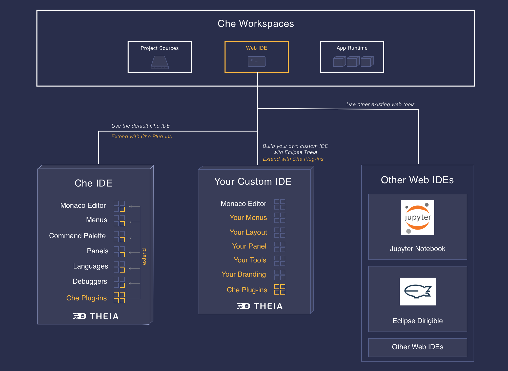


Che Plug-ins are bringing capabilities:

* *Languages* *Support:* Extend the supported languages by relying on the https://microsoft.github.io/language-server-protocol/[Language Server Protocol]. 
* *Debuggers:* Extend debug capabilities with the https://microsoft.github.io/debug-adapter-protocol/[Debug Adapter Protocol].
* *Development Tools:* Integrate your favorite linters, testing and performance tools.
* *Menus, Panels and Commands:* Add your own items to the IDE components. 
* *Themes:* Build custom themes, extend the UI, customize icon themes. 
* *Snippets, Formatters and* *Syntax Coloring* *Colorization:* Make the editor your own. 
* *Keybindings* *:* Add new keymaps and popular keybindings to make the environment feels natural.


Extending Eclipse Che can be done entirely using Eclipse Che. Since version 7, Eclipse Che provides a self hosting mode. Learn more on the following documentation. [TODO LINK]

  

    *** Extending the IDE with dev PluginsChe Plug-ins


Eclipse Che provides a default web IDE for the workspaces which is based on Eclipse Theia. It’s a subtle different version than a plain Eclipse Theia as there are functionalities that have been added based on the nature of the Eclipse Che workspaces. We are calling this version of Eclipse Theia for Che: *CheTheia.*


In CheTheia, you’ll find the following capabilities:


|===
| *Plug-in*                                                                                                                   | *Description*                                                                                                               | *Repository*                                                                                                                 
| *Che Extended Tasks*                                                                                                        | Handles the Che commands and provides the ability to start those into a specific container of the workspace.                | link                                                                                                                         
| *Che Extended Terminal*                                                                                                     | Allows to provide terminal for any of the containers of the workspace.                                                      | link                                                                                                                         
| *Che Factory*                                                                                                               | Handles the Eclipse Che Factories [TODO: LINK]                                                                              | link                                                                                                                         
| *Che Container*                                                                                                             | Provides a container view that shows all the containers that are running in the workspace and allows to interact with them. | https://github.com/eclipse/che-theia/tree/master/plugins/containers-plugin[Containers plugins]                               
| *Che Dashboard*                                                                                                             | Allows to integrate the IDE with Che Dashboard and facilitate the navigation.                                               | link                                                                                                                         
| *Che APIs*                                                                                                                  | Extends the IDE APis, to allow interacting with the Che specific components (workspaces, preferences, etc.).                | link                                                                                                                         
|===


When extending the IDE provided with Eclipse Che, you’ll be building a *Che Plug-in* . The Che Plug-ins are compatible with *CheTheia* or any other Eclipse Theia based IDE.


A Che Plug-in is built on either:

* A Visual Studio Code Extension
* An Eclipse Theia Plug-in


If you have already built your plug-in as a Visual Studio Code Extension, you can build the corresponding Che Plug-in by repackaging the extension. If the extension is relying on its own set of dependencies, you’ll need to package those into a container. Eclipse Che users will get the plug-in and not have to worry about the tools dependencies. 

Learn more about remote and local plug-in in the following section [TODO LINK].

Learn more about how to repackage a VSCode Extension into Eclipse Che [TODO LINK].


For the purpose of providing tools isolation and easy extensibility in Eclipse Che, we’ve added and maintain plug-ins APIs into Eclipse Theia. The APIs are providing compatibility with the Visual Studio Code Extension. You can read more on the following page [TODO LINK]. 

You can build a Che Plug-in, by implementing an Eclipse Theia plug-in and packaging it to Eclipse Che. Learn more about how to package an Eclipse Che Plug-in on the following page [TODO LINK].


If the plug-in you are authoring will rely or interact with the components of Che workspaces (containers, preferences, factories…), you can rely on the Che APIs that are embedded in CheTheia. Learn more about the Che APIs here [TODO LINK].


    *** Remote and Local Plug-in


Developer workspaces in Eclipse Che are providing all the dependencies needed to work on a project, it includes the dependencies needed by all the tools and plug-ins used in the Che workspaces. 


There are two different ways a Che Plug-in could be running, it essentially comes from the dependencies that are needed for the plug-in:

* *Local Plug-in:* The plug-in doesn’t have specific dependencies, except using nodejs runtime, it runs in the same container than the IDE and gets injected into the IDE. 
  ** Example: Code Linting, new set of commands, new UI components. 


* *Remote Plug-in:* The plug-in relies on dependencies and/or has a backend. It runs in its own sidecar container, with all dependencies packaged in. 
  ** Example: Java Language Server, Python Language Server. 


Depending on your use case and the capabilities provided by your plug-in, you select one of those two running modes.


    *** Alternate IDEs


It is possible to plug different IDEs with the Eclipse Che developer workspaces. There are a lot of cases where the default IDE will not cover the use cases of your audience, or you might want to provide a dedicated custom IDE for your tools. There are also cases where different stakeholders will be using the workspaces and you might want to provide them a different perspective. In the traditional Eclipse IDE world, that was done with RCP applications.


Eclipse Che provides a default web IDE to be used with the developer workspaces, but that IDE is completely decoupled. You can bring your own custom IDE for Eclipse Che:

* *Built from Eclipse Theia* , which is a framework to build web IDEs. You can learn more here. [TODO LINK]
  ** Example: Sirius on the web https://www.youtube.com/watch?v=B6aCqywKpyY&t=2s
* *Complete different web IDEs* , such as Jupyter, Eclipse Dirigible or others:
  ** Example: Jupyter in Eclipse Che workspaces https://www.youtube.com/watch?v=VooNzKxRFgw


About bringing your custom IDE built from Eclipse Theia:

* You can read the following documentation on how to create your own custom IDE based on Eclipse Theia here: [TODO LINK]
* You might want to add Eclipse Che specific tools into your custom IDE. Read the following page on how to do that: [TODO LINK]
* Read the following documentation to learn how to package your custom IDE into the available editors for Eclipse Che: [TODO LINK]


About bringing your complete different web IDE into Eclipse Che:

* Read the following documentation to learn how to package your custom IDE into the available editors for Eclipse Che: [TODO LINK]


    *** Features and benefits of Che Plug-ins


|===
| *Features*                                                                                             | *Description*                                                                                          | *Benefits*                                                                                              
| *Fast Loading*                                                                                         | Plug-ins are loaded at runtime and are already compiled. IDE is loading the plug-in code.              | Avoid any compilation time.Avoid post-install steps.                                                    
| *Secure Loading*                                                                                       | Plug-ins are loaded separately from the IDE. The IDE stays always in an usable state.                  | Plug-in don’t break the whole IDE if it has bugs..Handle network issue.                                 
| *Tooling Dependencies*                                                                                 | Dependencies for the plug-in are packaged with the plug-in in its own container.                       | No-installation for tools.Dependencies running into container.                                          
| *Code isolation*                                                                                       | Guarantee that any plug-in shouldn’t block the main functions of the IDE like opening a file or typing | Plug-ins are running into separate threads.Avoid dependencies mismatch.                                 
| *VS Code Extension Compatibility*                                                                      | Extend the capabilities of the IDE with existing VS Code Extensions.                                   | Target multiple platform.Allow easy discovery of VS Code Extension with zero install.                   
|===


  ** Installing a VS Code Extension[Sun Tan]


This section describes how we can install a [VS Code extension](https://marketplace.visualstudio.com/vscode) into a Che workspace with the example of the Sonarlint Extension. 


A VS Code extension can easily be bundled inside a Che devP plugin. The Che devPplugin would not only contain the VS Code extension, but also the container that would host that extension. Good thing with that container, it will be predefined with all the needed dependencies to run the VS Code extension. For instance, the container for the Java VSCode Extension would contain the right version of the JDK and also Maven or Gradle.


Let’s create the container that will host our VSCode extension.  It should be based on the `wsskeleton/theia-endpoint-runtime` image. This base image contains the runtime to launch VS Code extensions in sidecars. We will then add all the necessary tools/software/plugin dependencies, for instance java, Go etc., to our container image. A container image for our Sonarlint plugin looks like that: https://github.com/eclipse/che-theia/blob/master/dockerfiles/remote-plugin-runner-java8/Dockerfile[https://github.com/eclipse/che-theia/blob/master/dockerfiles/remote-plugin-runner-java8/Dockerfile] . and is available through Docker hub: garagatyi/remotetheia:java


A Che 7 plugin is defined by its `meta.yaml` file that describes the IDE plugin location (in our case a VSCode extension identifier from VSCode marketplace) and the container image that would host this plugin. Take a look to our Sonarlint Che devPplugin: https://github.com/eclipse/che-plugin-registry/tree/master/plugins/org.eclipse.che.vscode-sonarlint/0.0.1[https://github.com/eclipse/che-plugin-registry/tree/master/plugins/org.eclipse.che.vscode-sonarlint/0.0.1] 


```yaml
id: org.eclipse.che.vscode-sonarlint
+
version: 0.0.1
+
type: VS Code extension
+
name: vscode-sonarlint
+
title: Sonarlint code intelligence
+
description: VS Code extension that provides sonarlint features
+
icon: https://www.eclipse.org/che/images/logo-eclipseche.svg
+
attributes:
+
  extension: "vscode:extension/SonarSource.sonarlint-vscode"
+
  containerImage: "garagatyi/remotetheia:java"

```


*  `extension` attribute consists of prefix `vscode:extension/` and VS Code extension ID that can be retrieved from plugin details page at  [VS Code marketplace](https://marketplace.visualstudio.com/)


* `containerImage` attribute contains the container image name `registry/org/repo:tag`. This attribute is optional. Without it, the extension would run on the Che-theia ide container.


To activate your VSCode Che plug-in with your Che workspace, you would add its location to the workspace config. 


```json
"attributes": {
    "editor": "org.eclipse.che.editor.theia:1.0.0",
    "plugins": "che-machine-exec-plugin:0.0.1,https://raw.githubusercontent.com/eclipse/che-plugin-registry/master/plugins/org.eclipse.che.vscode-sonarlint:0.0.1"
  }
```


In this example, we have activated two devPlugins: che-machine-exec-plugin and Sonarlint.

However these have been referenced in different ways.

* Sonarlint devPlugin is referenced through its location in a custom registry: `https://custom.registry.location.url:version` . In our case the registry location would be https://raw.githubusercontent.com/eclipse/che-plugin-registry/master/plugins/org.eclipse.che.vscode-sonarlint[https://raw.githubusercontent.com/eclipse/che-plugin-registry/master/plugins/org.eclipse.che.vscode-sonarlint]. And the version: 0.0.1. It turns out that it would get the content directly from https://che-plugin-registry.openshift.io/plugins/org.eclipse.che.vscode-sonarlint/0.0.1/meta.yaml[https://che-plugin-registry.openshift.io/plugins/org.eclipse.che.vscode-sonarlint/0.0.1/meta.yaml] 
* Che-machine-exec-plugin is referenced by its ID defined in the default Che devPlugin registry. The default Che devPlugin registry is located here: https://che-plugin-registry.openshift.io/plugins/[https://che-plugin-registry.openshift.io/plugins/]  .


There are other ways to include a vscode extension that is not in the VSCode marketplace.


Restarting the workspace, you should see the logs listing the plugins being installed. We can see our Sonarlint Che-VSCode plugin.

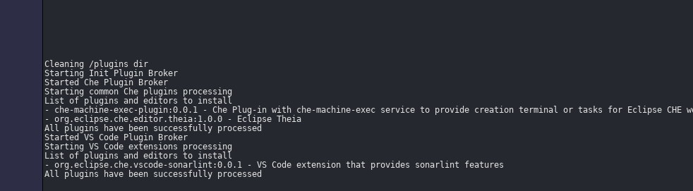


And try out the extension with a simple JS projects with bugs:

TODO include screenshot of sonarlint errors in che-theia once https://github.com/eclipse/che-theia/issues/62[https://github.com/eclipse/che-theia/issues/62] is fixed ?


* How to add it to the main Eclipse Che plugin registry? 


To have a Che VSCode devPlugin available to the default Che devPlugin registry, you can create a Pull Request to that GitHub repository:  https://github.com/eclipse/che-plugin-registry/tree/master/plugins[https://github.com/eclipse/che-plugin-registry/tree/master/plugins] with your `meta.yaml` file in the `plugins/yourpluginid/version/` folder. For instance, Sonarlint VSCode devPlugin is located in `plugins/org.eclipse.che.vscode-sonarlint/0.0.1/meta.yaml`


TODO: Add a sample PR adding a plugin to the registry.

 

Once new devPlugins are added and merged to that repository, devPlugins are getting updated in https://che-plugin-registry.openshift.io/plugins/[https://che-plugin-registry.openshift.io/plugins/] list.


  ** Packaging an Eclipse Theia Plug-in


As Theia extensions need Theia to be rebuilt, we. The Theia extensions are not a recommended pattern for unless your are building your own custom IDE.


  ** Packaging a new editor
  ** Supporting other plug-in types with Plug-ins Brokers [OleksandrG]


Che has devPlugin brokers. The purpose of devPlugin brokers is to handle a specific way to install a devPlugin into Che. There are several type of devPlugins that can run on different editors and may be packaged differently. So each cases requires a specific installation.

At the moment, according to the `type` metadata of the devPlugin, Che would start the right broker and process the specific installation process.

We have these below devPlugin types and each of them has a broker implementation:

* Che-VSCode plug-in
  ** Sidecar containers
  ** A reference to a vscode extension (in the market place)
* Che plug-in
  ** Sidecar containers
  ** Editor commands
* Theia plug-in
  ** A .theia file with
    *** The plugin on a che-theia editor
    *** Optionally sidecars container
* Editor plug-in
  ** A containers with a web app (editor)
  ** Sidecar containers


Each type of plugin have a corresponding broker. Broker install process for each type is describe here: https://github.com/eclipse/che-plugin-broker/blob/master/README.md[https://github.com/eclipse/che-plugin-broker/blob/master/README.md] 


  ** Contribute to Eclipse Che
    *** Links to repositories
    *** How to build
    *** How to run
    *** ...


*  P1 *Creating Eclipse* *Che* *Plug-ins with Eclipse Che*
  ** Developing your first plug-in [Mykola]


_Creating workspace for development_

Che 7 has dedicated stack for plug-ins development. Go to Che Dashboard, switch to `Workspaces` tab and click `Add Workspace`.

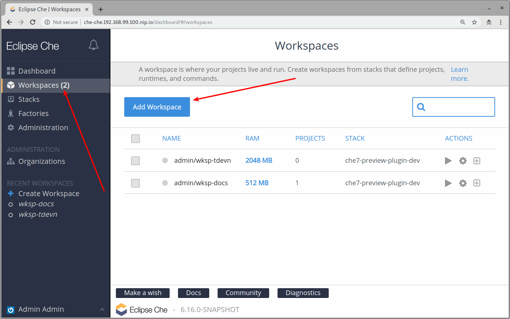

Then select `Che 7 Dev` stack and click `Create & Open`.


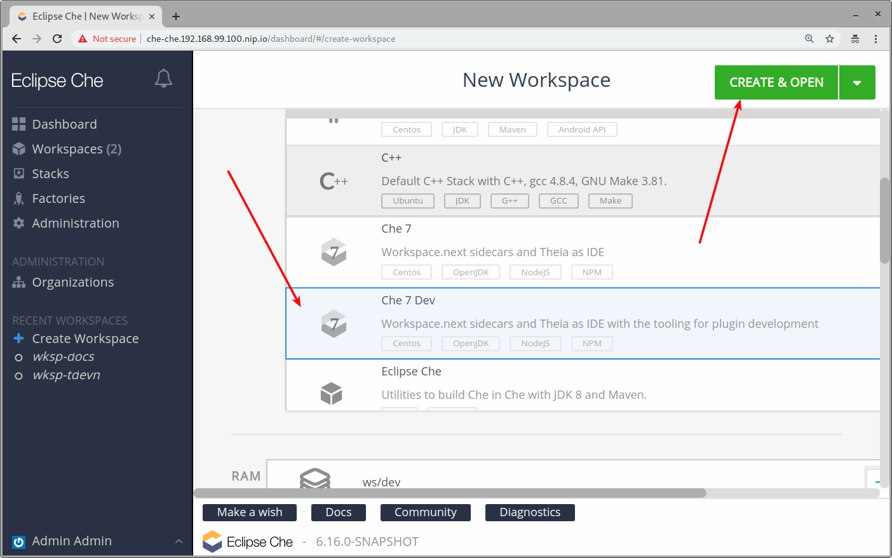


_Generate plug-in scaffold_

The workspace created from this stack provides an easy way to quickly scaffold a new plug-in. When the workspace is started and fully ready,  execute `Yeoman Wizard` from the command palette. Press `F1` or `Ctrl` + `Shift` + `p` to invoke the command palette and start typing the command name `Yeoman ...` (note: you can use the keyboard to navigate through the proposed commands).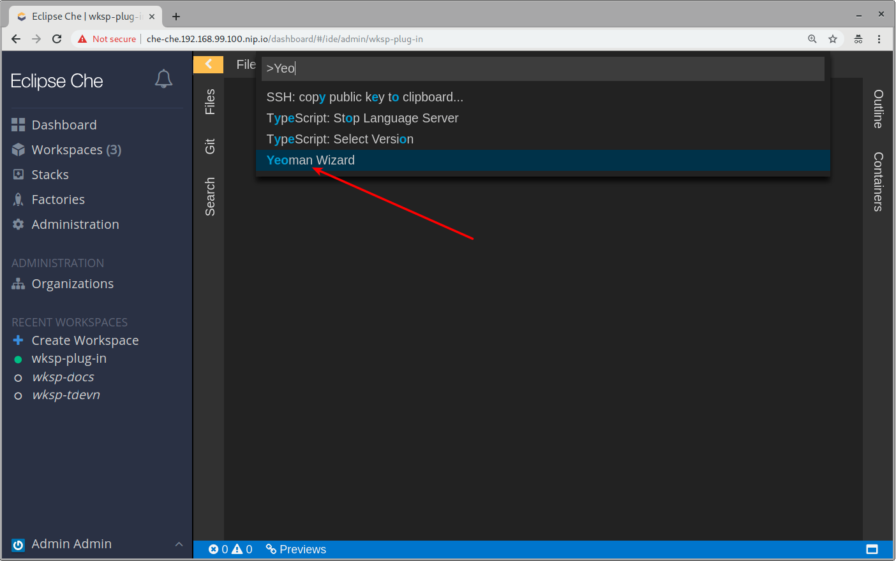

Once the command invoked, you’ll be asked some questions about the plug-in you want to create: 

* plug-in name: provide `my-first-plugin`
* plug-in type: select `backend plug-in
* plug-in template: select `Hello World plug-in` 

You’ll get a a message confirming the plug-in generation has been successful.

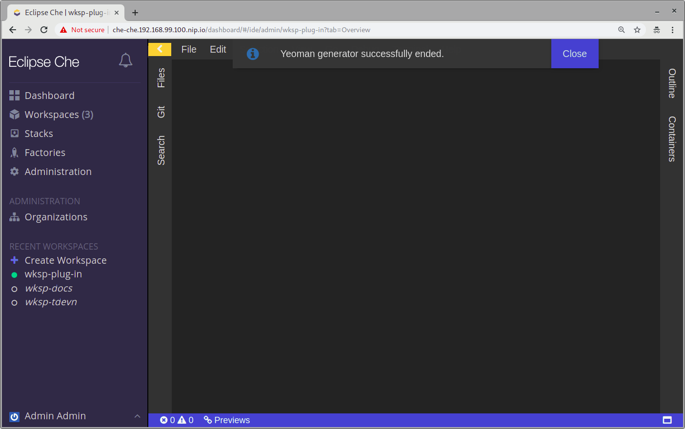

You can open the `Files` panel, to see the sources of the generated plug-in sources, they’ll be in `src` directory. 


_Build plug-in_

You’ve successfully created a new plug-in. Now you need to build it. Open a new terminal in development container (use `Ctrl` + ` ` ` then select `ws/dev`).

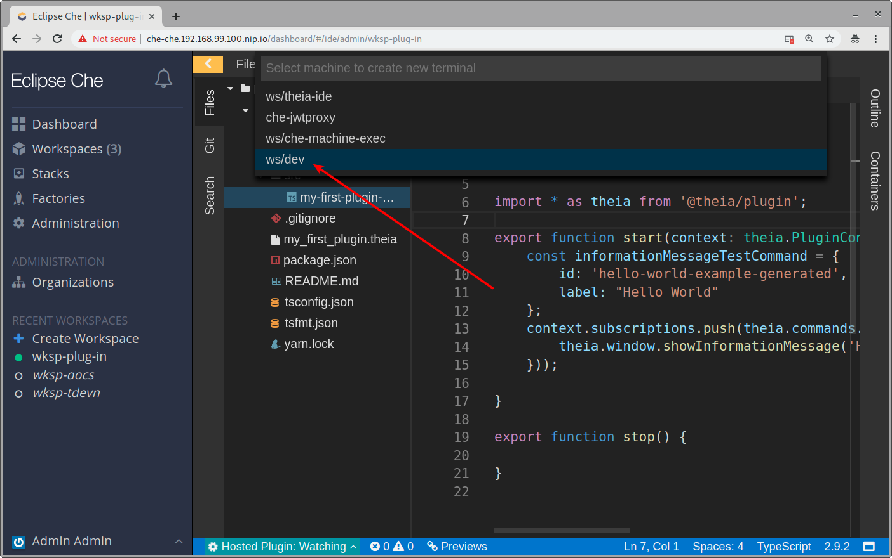

In the terminal go to plug-in directory and run `yarn` command.


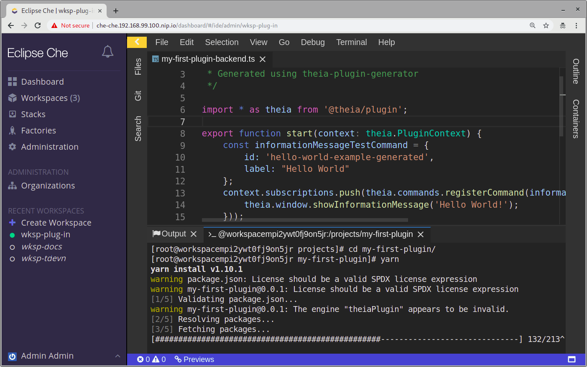

Note: the plug-in generator automatically built the plug-in after its generation.


_Run plug-in_

Now, you want to see your plug-in in action in the IDE. For that you can use the “Hosted mode” to start a new IDE instance and get the plugin installed in it. This way, you’ll have two IDEs running, one for developing your plug-in and one to test it. 

For that just execute in the command palette the command: `Hosted Plugin: Start Instance` from command palette (`F1 ` and type command name) and then select path to the root directory of the plug-in in your workspace. 

You might have a warning that your browser prevented opening of a new tab. In this case, just click `Open` button in the dialog. After that new tab with another Theia instance which has developed plug-in loaded will be opened.

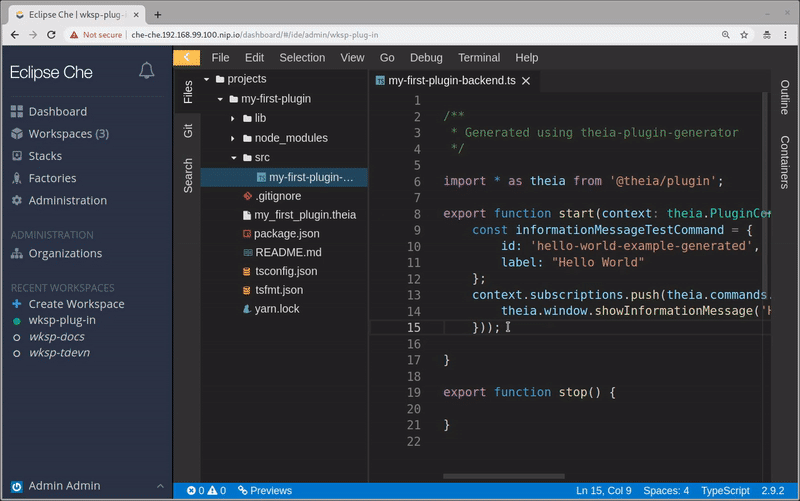


_Debug plug-in_

Of course, you should also be able to debug your plug-in from the IDE. 

In the source code of your plug-in, set a breakpoint by clicking behind line number (in the editor gutter). 

For the purpose of this tutorial, you can set the breakpoint line 14 in the file `my-first-plugin-backend.ts`

Still by using the command palette, stop your Hosted Plug-in instance, if any, by `Hosted Plugin: Stop Instance` command and start it again but in debug mode via `Hosted Plugin: Debug Instance` command. Switch to the Hosted Instance tab and do some actions to reach code with breakpoint. Then go back to Main Theia and use Debug panel as you need.

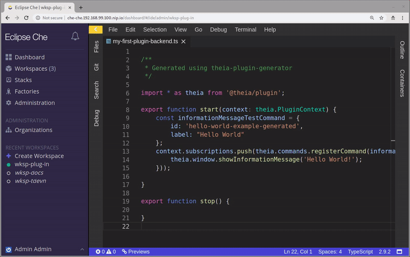


Note, in case of frontend plug-in debugging is even more simpler: just use browser’s dev tools.


_Learn more about developing plug-ins for Eclipse Che Theia_

For more details about plug-ins, you are in the right section! Also see #bookmark=id.oyj1p834t349[plug-in API reference] for all available APIs. https://github.com/eclipse/che-theia-samples[Plug-ins samples] might be useful as well.


  ** What is a Plug-in
    *** Plug-in concept in details [Oleksii O]


Stevan Attempt:


Eclipse Che has the notion of devPlugin which can be leveraged into a developer workspace. A devPlugin is defined by:

* A type:
* A packaging:
* A set of metadata:
* ...


The different types of plugins are the following:


|===
| Dev Plug-in Type | Description       
| VSCode           |                   
| Editor           |                   
| Che plug-in      |                   
| Theia plug-in    |                   
|===


devPlugin have two different modes:

* Local
* Remote


devPlugin are packaged and defined with:


Summary:


|===
| Dev Plug-in Type | Available mode   | Packaging        | Broker           | Sample            
| VSCode           | Local and remote | container        |                  | link              
| Editor           | remote           |                  |                  | link              
| Che plug-in      | Local and rmote  |                  |                  | link              
| Theia plug-in    |                  |                  |                  | link              
|===


Explain isolation of plugin


Diagram for each of the plugin would pretty nice.


In Che7, each workspace can start with plugins. Che7 plugins are also called `devPlugin`. There are several kind of devPlugin:

* Che-VSCode plug-in: a VSCode extension + sidecar containers
* Editor: A containers with a web app (editor) and sidecar containers
* Che plug-in: sidecar containers and Che editor commands
* Theia plug-in: editor plugin and sidecar containers


devPlugins are published in https://github.com/eclipse/che-plugin-registry[che-plugin-registry](a simple service which hosts metadata about some plugins) and we can see a subset of editors in plugins registry.
+

+
These CHE 7 pdevPlugins can include a new container with needed software and have a lot of params, which described in each plugin metadata. For now, our Che-plugins can contain Theia editor andor plugins for the Theia editor. So,  one Che-pdevPlugin would adds Theia editor into the workspace and the second would- add Theia plug-inone or more plugins for the to the Theia editor.   


* _Theia editor plug-ins_

Theia editor plug-ins let you add languages, debuggers, and tools to your installation to support your development workflow. They are something runnable at the end of editor loading. In the case when Theia editor plug-ins are failing, the main Theia editor is continuing to work.

For some cases we can have Theia editor plug-ins running on the client side, for some other cases, we can use server side.


The main conception for client-side and server-side Theia editor plugins:

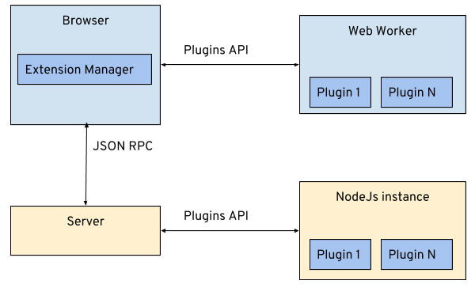


  The same Theia editor plug-ins API is exposed for plugins whatever they will run on client’s side (Web Worker) or on the server side (NodeJs instance).


+
Theia plug-ins APIs is compatible withttps://code.visualstudio.com/api[h VS Code extension AP]Is and in the general case, Theia can be used to run the VS Code extension as a plugin for Theia.


In the case with server-side Theia plugin, it can be  Embedded or Remote. 

To creating a Theia plugin we can use a plugin wizard. It is the simplest way. 


    *** Plug-in metadatas [Oleksii O]

Che-pdevPlugin metadatas are describing information it is a short information about the plug-in for thewhich we have in plugin-registry. The devPlugin metadatas are defined in the meta.yaml of the devPlugin. (represented with meta.yaml).


Interface for the Theia plugin metadata object

```

`{
    id: string;
    version: string;
    type: string;
    name: string;`

        title: `string;`

`description: string;
    url: string;
 }`

```


The most important thing there is the “url” by which plugin configuration could be found. Usually it is a tar archive with plug-in yaml file. 


In case when we want to add  a VSCode extension from oficial https://marketplace.visualstudio.com/[ Marketplace] by ID - field “url” field should be replaced with “attributes” section which contains  “ `extension` ” and  “ `container-image` ” fields:


Interface for the Che-VSCode plug-inextension metadata object

```

`{`

`id: string;
    version: string;
    type: string;
    name: string;`

        title: `string;`

`description: string;`

`Attributes: {`

`extension: string;`

`containerImage: string;`

`}`

`}`

```

where `“extension”` holds the VSCode extension ID with “vscode:extension/” prefix, “container-image” points to docker image in which this extension should be run. The image should be based on `wsskeleton/theia-endpoint-runtime` to be able to host VSCode extension or Theia plugins.


 Note, the image should contain infinity ENTRYPOINT. For example “ENTRYPOINT tail -f /dev/null”. And can be created with a Dockerfile.


For example
+


```dockerfile
FROM node:8
ENTRYPOINT tail -f /dev/null
```


```yaml
id: ms-vscode.cpptools
version: 0.20.1
type: VS Code extension
name: C/C++ tools
title: C/C++ tools
description: C/C++ IntelliSense, debugging, and code browsing https://marketplace.visualstudio.com/items?itemName=ms-vscode.cpptools
icon: https://www.eclipse.org/che/images/logo-eclipseche.svg
attributes:
 extension: "vscode:extension/ms-vscode.cpptools"
 container-image: "userId/ms-vscode.cpptools"
```


The most detailed information about the plugin was packed in it as "che-plugin.yaml" file.  For example: https://github.com/ws-skeleton/che-editor-theia/blob/master/etc/che-plugin.yaml[the "che-plugin.yaml" file  for "theia" editor] and https://github.com/eclipse/che-machine-exec/blob/master/assembly/etc/che-plugin.yaml[the "che-plugin.yaml" file  for  “che-machine-exec” plugin] for it:


    *** Plug-in Lifecycle [Oleksii O]

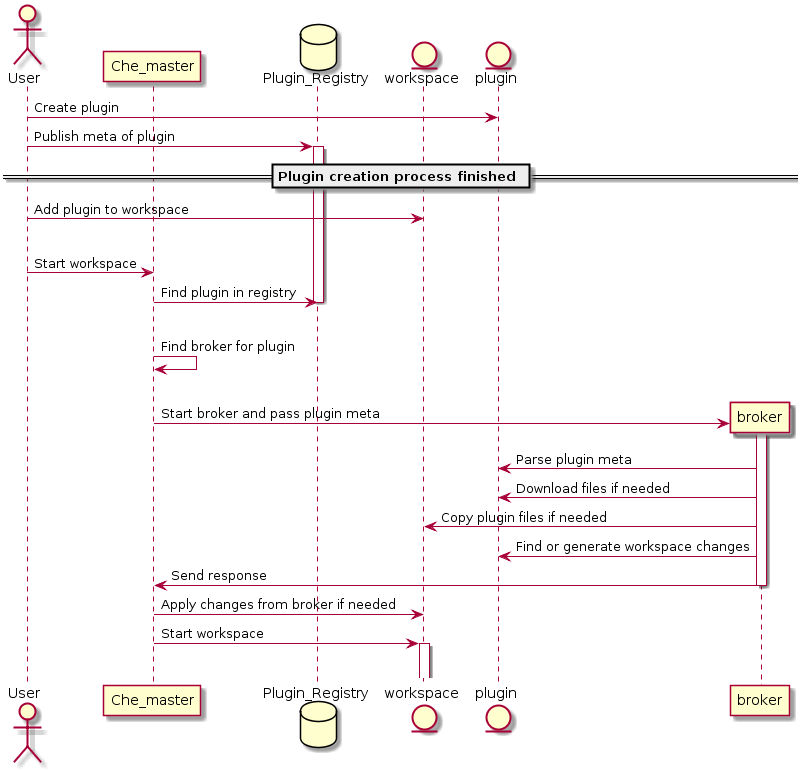


devPlugins’ life cycle:

* When a user is starting a workspace, Che master will check for the plug-ins to start from the workspace definition
* Plug-ins metadatas are retrieved and the type of -each plug-ins is then known
* A broker is selected according to the plug-in type. The broker would process the installation/deployment of the plug-in. Installation process would be different for each broker.


As mentioned previously, we have several type of plug-in (see here). The broker is making sure all installation requirements are met for the plug-in to be deploy correctly. Let’s take the Theia plug-in life cycle:

Before Che workspace master starts containers for a workspace,

* The Theia plug-in broker will extract the plug-in (.theia) to get the sidecars containers that the plug-in needs
* The broker sends the appropriate container informations to Che master
* The broker copies the Theia plug-in to volume to have it available for the Theia Editor container.
* Che workspace master is then starting all the containers of the workspace.
* Theia is started in its own container and checks the right folder to loads the plug-ins.


Theia plug-in lifecycle.

* When the user is opening a browser window to Theia, Theia starts a new plug-in session (browser or remote). Each theia plugins will be notified that a new session has been started ( have their ‘start()’ function of the plug-in triggered).
* Theia plug-in session is running and interacts with the Theia backend and the Theia frontend
* When user is closing the browser tab or goes to timeout, the plug-in session is stopped. eEach plug-in is notified (s will have their ‘stop()’ function of the plug-in triggered).


  ** Embedded vs Remote Plug-in(Oleksandr Andriienko)


Theia plugin extends Theia IDE functionality with help plugin api compatible with VSCode. But how to include Theia plugins or VSCode extensions inside Eclipse CHE workspace? For this purpose used Eclipse CHE plugin. Let’s take a look what is it.


Eclipse CHE 7 workspace brings for development few important components: editor (by default it’s Theia) and components to extends editor functionality - Eclipse CHE plugins. So, Eclipse CHE plugin extends workspace editor functionality.  Eclipse CHE plugin it’s not the same like Theia plugin. It’s a way to include Theia plugins or VSCode extensions inside Eclipse CHE workspace editor - Theia. 


Information about Theia plugins or VSCode extensions stored in the metadata files in the yaml format. So, to give ability launch your Theia plugin or VSCode extension inside Eclipse CHE you need define this file(#bookmark=id.f77tz72etr0i[Plug-in metadatas]). Then plugin should be published in the plugin registry(Se more: #bookmark=id.ci7ir4tt7y3m[How to add it to the main Eclipse Che plugin registry?...], #bookmark=id.zaba20njwae7[Official registry] ,#bookmark=id.q3cyci6i4gv4[Custom registries]).


We have two types of the Theia plugins for Eclipse CHE: embedded and remote. 


    *** Introduction of Embedded Plug-in (diagram)


Embedded Theia plugin located in the same container with Theia editor.

To include Theia plugin like embedded, you need to define in yaml meta file url to plugin binary(.theia archive). In case VSCode extension could be used VSCode extension id from Visual Studio marketplace(#bookmark=id.yslox3xyq4p[Installing a VS Code Extension[Sun Tan]]). Eclipse CHE on workspace starting downloads and unpacks binaries and include them to the Theia editor container. Theia editor on start initialize this Theia plugins or VSCode extensions.

 


    *** Introduction of Remote Plug-in (diagram)

Remote Theia plugin - it’s a separated container with launched Theia plugin(s) or VSCode extension(s) inside.

Remote Theia Eclipse CHE plugin consist of two part:

* theia plugin(s) or VSCode extension(s) binaries; This part should be defined (in the meta yaml file) in the same way like embedded plugin;
* Container’s image definition - linux container image, for example `eclipse/che-theia-dev:nightly`. From this image Eclipse CHE creates separated container inside workspace;

Eclipse CHE on workspace start creates container from image, downloads and unpacks binaries and include them to the created container. Theia editor on start makes connections to the remote CHE plugin.


    *** Comparison matrix

In common case if Theia plugin/VSCode extension don’t need some extra dependencies inside container, you could define it like embedded plugin. Otherwise you could define container with extra dependencies and include Theia plugin/VSCode extension like remote plugin.


|===
|                                                                                                                                                                  | *Configure RAM per plugin*                                                                                                                                       | *Environment dependencies*                                                                                                                                       | *Create separated container*                                                                                                                                      
| *Remote*                                                                                                                                                         | TRUE                                                                                                                                                             | plugin uses dependencies defined in the remote container.                                                                                                        | TRUE                                                                                                                                                              
| *Embedded*                                                                                                                                                       | FALSE(user could configure ram for whole editor container, but not per plugin).                                                                                  | plugin uses dependencies from editor container. If container doesn't contains this dependencies - plugin fail or not all function of the plugin works correctly. | FALSE                                                                                                                                                             
|===


  ** Creating New Plug-ins
    *** Explain how to scaffold a new plugin


There are two ways to scaffold a new plugin inside che-theia:

* Use console plugin generator(based on Yeoman generator);
* Use che-theia ‘Yeomand wizard` command to generate new plugin(user uses che-theia command palette to launch this command);

Following You can learn how to use both ways.

    *** List of plugin samples


Che-theia plugin generator provide for user list with predefined samples to generation:

* [.underline]#Hello World plugin# : This plugin register new che-theia command. When You launch this command che-theia display notification with text `Hello World`. This is good first example illustrate ability define and use command inside che-theia.
* [.underline]#Skeleton plugin# : This plugin print in the browser log current theia window state.
* [.underline]#Samples plugin# : contains examples with theia api usage:
* Commands sample: This plugin describes how could be defined che-theia command with arguments. Command arguments could be useful in case of some another plugin need to call command and apply some information in the command arguments. 
* Information message sample: example how to define and show information modal message.
* Quick pick sample: example how to define command list with items, and handler for selected item.
* Status Bar item sample: example how to apply information to the status bar. Status bar it’s a widget-footer located in the bottom Theia.


    *** Plugin generation


To speed plugin development and good first experience there is available plugin generator( `@theia/generator-plugin` ) to creation new plugin from the scratch. Plugin generator provides Yeoman wizard for generation new plugin step by step. There are three steps:

* Set up project name for feature plugin;
* Set up plugin type. Theia plugin api has two plugin types: frontend(plugin works on the client side) and backend(plugin works on the server side). So during plugin creation you should think about plugin purpose and select preferable plugin type for this purpose;
* Select plugin sample from the #bookmark=id.ood4krl7bf7p[list plugin samples]; Todo Add link to the section *List of plugin samples*

Todo Apply stack for development: For plugin development inside Eclipse CHE You could use any stack, but apply theia-dev plugin.  This stack contains installed npm, node, git and preinstalled `@theia/generator-plugin.`


*Installation plugin generator*

To check yo was installed inside dev container:

$ yo --version

`Yo` tool should return version, for example ` `2.0.5` `

To check if @theia/plugin generator was installed:

$ yo --help

`Yo` tool should return output with information about pre-installed generators. For example:

…

`Available Generators:                                                                                                                                                        ```

`` @theia/plugin

In case if container doesn’t contains installed @theia/generator-plugin, install this tools manually:

`$ yarn add global yo @theia/generator-plugin`


*Generate new plugin with help console.*

Create new terminal inside Eclipse CHE workspace with help menu `Terminal` on the main menu bar. Run generator with help commands:

$ yo @theia/plugin


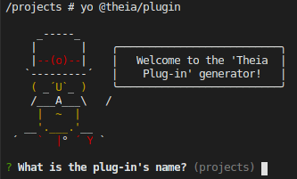

Fill information for plugin generation. For example:

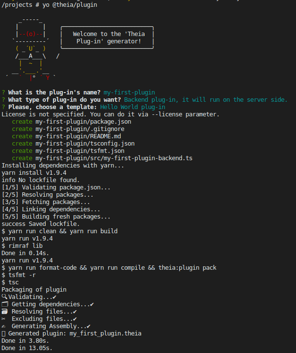

After that in generated plugin sample should appear on the `Files` panel. This sample has already compiled and contains plugin binary. In this example plugin binary it’s my_first_plugin.theia. 

Notice: also you could launch ‘yo’ and select @theia/plugin generator from the list:image:img_15.png[]


*Generate new plugin with help of Yeoman wizard plugin.*

Che-theia provides `Yeoman wizard` command to create new plugin with help command palette. To launch command palette use  hot-key `Ctrl + Shift + P`(or `Cmd + Shift + P for Mac`). Theia will open `Command palette` widget with list all available command for Theia. In the widget input type `Yeom` to filter commands. Select `Yeoman Wizard` command with help keyboard keys `Arrow Up/Down`:

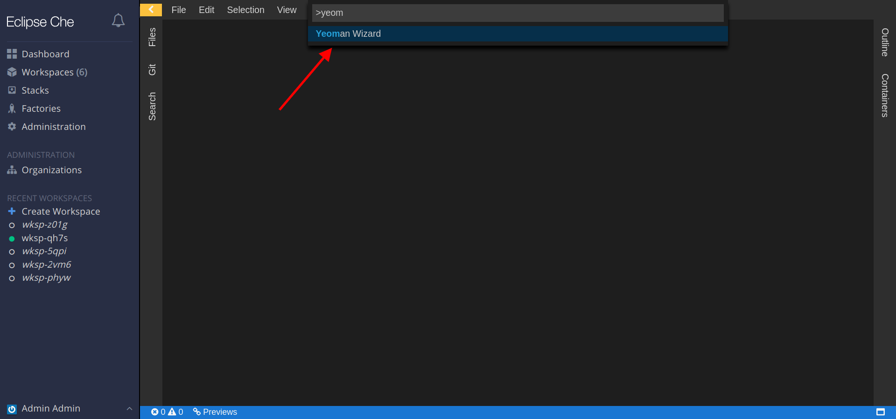

Click on the `Yeoman Wizard` item or type `Enter`. After few seconds Yeoman wizard will display input to type new project name.

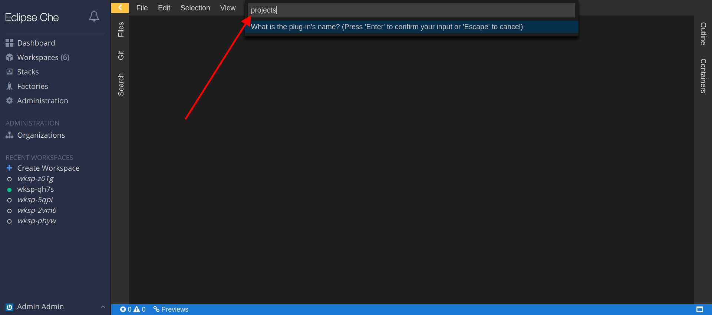

Type new project name and click Enter. Yeoman wizard  will display propose to select plugin type: `frontend` or `backend`:

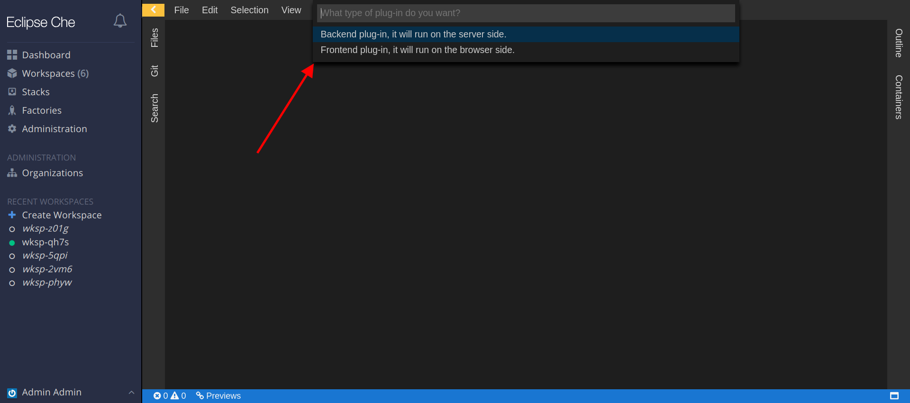

Select preferable plugin type, click Enter. Yeoman wizard will display propose to select plugin sample from the #bookmark=id.ood4krl7bf7p[list plugin samples]:
+

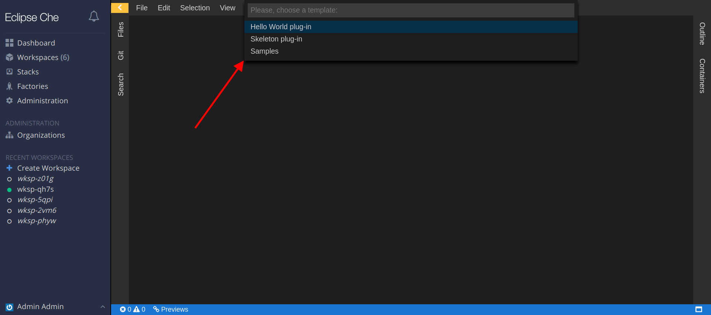

Click Enter - Yeoman wizard should generate new plugin from selected sample and display result of the work:

image:img_20.png[]


After that in generated plugin sample should appear on the `Files` panel. 

*Note:* Yeoman generator also print logs about plugin generation to the Output widget in the bottom Panel:

 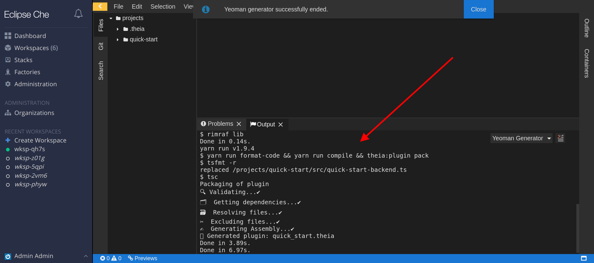

*Note:* Yeoman Wizard works only if Theia has some opened `Theia workspace`.


    *** Links to “How-to” guides
  ** Developing Plug-ins [Vitaliy]
    *** Explain what is the developer experience


* Generate or clone your plugin
* Build
* Run
* Rebuilding
* Watching
* Debugging your plugin
* Testing your plugin
* Push your plugin on GitHub
* Publish your plug-in


    *** Explain self hosting [Vitaliy]

You can test how your plugin works while you are developing it. For that you can run Theia in hosted mode. It’s a special mode in which Theia loads your plugin directly from /projects directory in comparing with other plugins, that are loaded from the plugin registry.

It’s very similar to debug mode in VS Code.

_Start hosted Theia instance_


To test your plugin press F1, find and execute `Hosted Plugin: Start Instance` command. Then you will need to specify path to the plugin and new browser tab will be opened. 

When Theia is running in the Hosted Mode it displays `Development Host` element in the status bar. When you hover on it, you will get a small hint with a name of the hosted plugin.

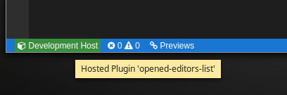


_Do some changes_


When the hosted instance is running, the main instance of Theia displays `Hosted Plugin` element in status bar. This element indicates the state of the hosted instance. Just after starting hosted instance, main Theia begins to watch the code changes. When you change something in your plugin, you can just switch to the hosted Theia and refresh the page. You will be able to see the result immediately.

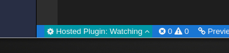


_Control hosted Theia instance_


You can control the state of the hosted instance directly from the main one. When clicking the status bar element the popup menu with available actions will be displayed. You will be able to stop and restart running Hosted Theia instance or Start if the instance is stopped.  

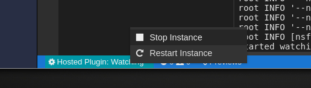


_Plugin output_


As soon as you run hosted instance, the main Theia will open output view. This view containing all outputs from `yarn` backend process. It also containing outputs when you are developing backend plugin.

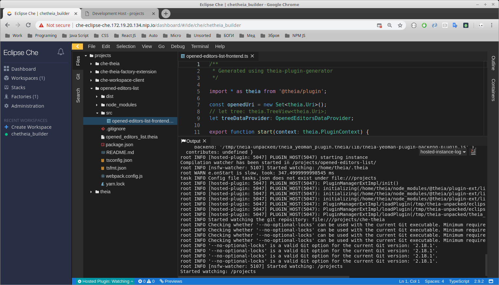


*Show code completion*

There is a full code completion provided to help you write your plugin. Code completion covers both Theia plugin API and Che plugin API.

Let’s write few lines of code as on the demo delow. Your plugin will handle an opening a document and will display a notification message when the document being opened. 

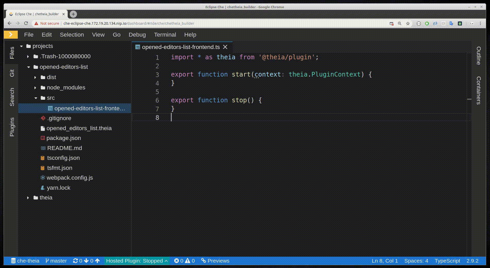 


  ** Testing Plug-ins
  ** Publishing Plug-ins 
    *** Plug-in registry [Mykola]


Plug-in registry is a simple service which hosts information (metadata) about some plug-ins.


The full list of plug-ins which are hosted in a registry could be retrieved by following path:

 `<registry-base-uri>/plugins/index.json`

Each plug-in item in the list is represented with json. Sample plug-in json:


```json
{
+
    "id": "che-dummy-plugin",
+
    "version": "0.0.1",
+
    "type": "Che Plugin",
+
    "name": "Che Samples Hello World Plugin",
+
    "description": "A hello world theia plug-in wrapped into a Che Plug-in",
+
    "links": {
+
      "self": "/plugins/che-dummy-plugin/0.0.1/meta.yaml"
+
 }

```


Where field `links.self` is pointing to more complete plug-in description (meta.yaml):


```

`id: che-dummy-plugin
version: 0.0.1
type: Che Plugin
name: Che Samples Hello World Plugin
title: Che Samples Hello World Plugin
description: A hello world theia plug-in wrapped into a Che Plug-in
icon: https://www.eclipse.org/che/images/logo-eclipseche.svg
url: https://github.com/ws-skeleton/che-dummy-plugin/releases/download/untagged-8f3e198285a2f3b6b2db/che-dummy-plugin.tar.gz`

```


The most important thing there is the `url` by which plugin configuration could be found. Usually it is a tar archive with plug-in yaml file. But it is also possible to have a link to raw content of plug-in yaml.

In case of VSCode extension `url` field is replaced with `attributes` section:


```

`attributes:`

`extension: "vscode:extension/extension.id"`

`container-image: "my.docker.registry/remote-theia:tag"`

```


where `extension` holds the VSCode extension ID with `vscode:extension/` prefix, `container-image` points to docker image in which this extension should be run. Note, the image should contain appropriate nodejs version with installed dependencies for Che Theia remote plug-ins.


For more details about plug-in yaml structure see #bookmark=id.f77tz72etr0i[corresponding section]. 


_Official registry_

Official Che plugin registry is https://che-plugin-registry.openshift.io[https://che-plugin-registry.openshift.io].  By default Che Dashboard shows editors and plugins from there.

Sources is located here: https://github.com/eclipse/che-plugin-registry[https://github.com/eclipse/che-plugin-registry].


_Custom registries_

One may setup own plug-in registry. For more information see description of https://github.com/eclipse/che-plugin-registry[official registry repository]


There are two ways of using plug-ins from a custom registry:

* Specify link to plug-in in configuration, see #bookmark=id.5582xvswun9w[Adding a plug-in into a workspace via configuration]
* Replace default official registry with custom in your Che instance. To reach that set `PLUGIN_REGISTRY_IMAGE` in Che config. But note, plugins from official registry won’t be available from dashboard interface. To add them just add references into your registry from official one.


    *** Adding a plug-in into a workspace [Mykola]


There are 3 ways of adding a Theia plug-in into Theia IDE:

* Via dashboard. Go to `Workspaces` tab in dashboard, select workspace into which plugin should be added, then in workspace details switch to `Plugins` tab and select required plugins.

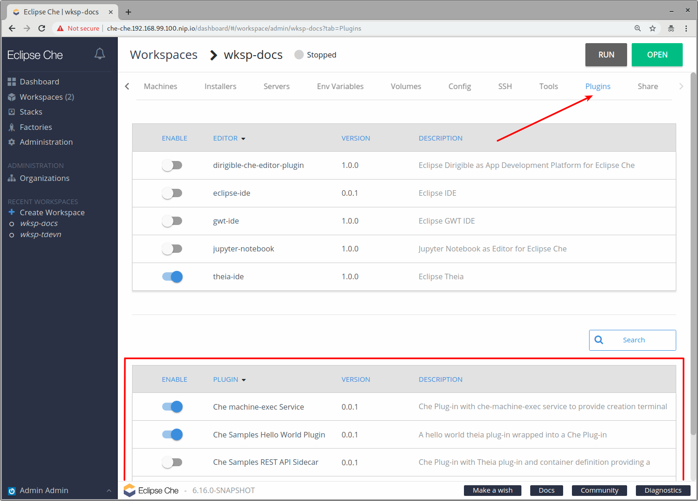


* Via workspace config. Might be useful, when there is a need to add plugins from non-default registry. Go to `Workspaces` tab in dashboard, select workspace into which plugin should be added, switch to `Config` tab and find `attributes.plugins` section.

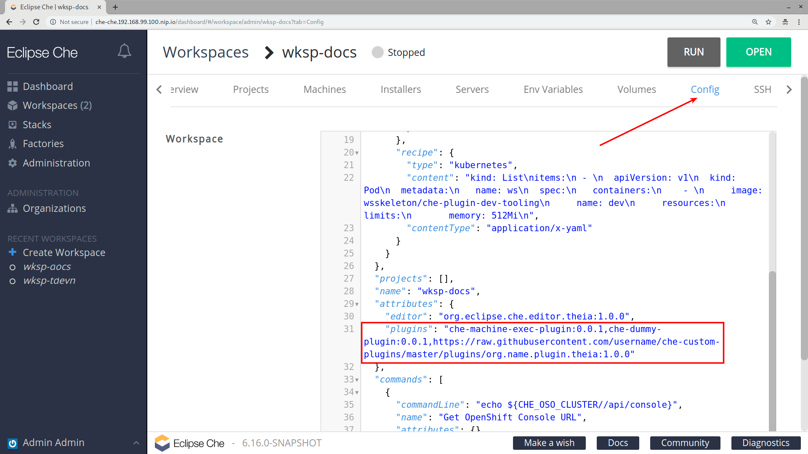

All plugins are separated by comma symbol (`,`). To add plugins just add new records after the separator. A record has following format:

 <registry-base-uri>/plugins/<plugin-name>:<version>

Examples:

https://custom-registry/plugins/org.name.plugin.theia:1.0.0

https://raw.githubusercontent.com/username/che-custom-plugins/master/plugins/org.name.plugin.theia:0.0.1


* In Runtime. This way adds a plugin into already running workspace, however it will last there until workspace stop. This is a good way to try or test a plugin without touching permanent workspace configuration. To use it, execute `Deploy Plugin by Id` command and specify ID of plug-in which should be added into the workspace. Plug-in ID could be:
  ** Local directory with plug-ins. Then all the plug-ins binaries (.theia files) in the specified directory will be loaded. Example: `local-dir:///home/theia/plugins/`
  ** VSCode extension link. To get such link go to VSCode marketplace, find needed extension, copy its ID and append the ID to `vscode:extension/` prefix.

For example, for XML language server (https://marketplace.visualstudio.com/items?itemName=redhat.vscode-xml) plug-in it is: `vscode:extension/redhat.vscode-xml`

  ** Link to plug-in binaries (.theia file). Could be http or https. Example: `https://domain.net/path/plugin.theia`

Note, to check if plugin loading was successful open `Plugins panel` (Could be opened via `Main Menu` -> `View` -> `Plugins`) and search for the plug-in in the list.


    *** Sharing your plug-in with a Factory [Mykola]


At some point of a plug-in development, it is might be needed to share the plug-in with some people (QE, friends, etc.). This could be reached via #bookmark=id.ohthtth532b5[factories] in following ways.


_Sharing factory with dev environment of the plug-in_

This is simpler way, but requires some actions from other side. Just create a #bookmark=id.7ico9ly8r3o0[factory] with the plug-in dev environment and share it. Reviewers will get exactly the same environment and should build & run the plug-in to test it (a script and/or instructions how to build might be included in the plug-in repository). Also this brings advantage: they could modify the plug-in and easily (if they have write access to the repository with the plug-in) contribute back.

To make reviewers work a bit easier it is possible to invoke a command to build the plug-in after factory load finishes. For more details see corresponding factory #bookmark=id.2wfhb0qr7h35[documentation]. So the manual part is only to start hosted plug-in instance specifying the path to the plug-in project inside workspace.


_Sharing factory with plug-in in configuration_

This way doesn’t require any additional action from other side and provides workspace with ready to use plug-in, however, plug-in writer should host plug-in binaries somewhere (see #bookmark=id.q3cyci6i4gv4[Custom registries] section).

Create a factory and go to the factory details, scroll to `Configuration` section. Finally, add the plug-in into `workspace.attributes.plugins` field of factory json. Format is the same as described in #bookmark=id.5582xvswun9w[Adding a plug-in into a workspace via configuration].


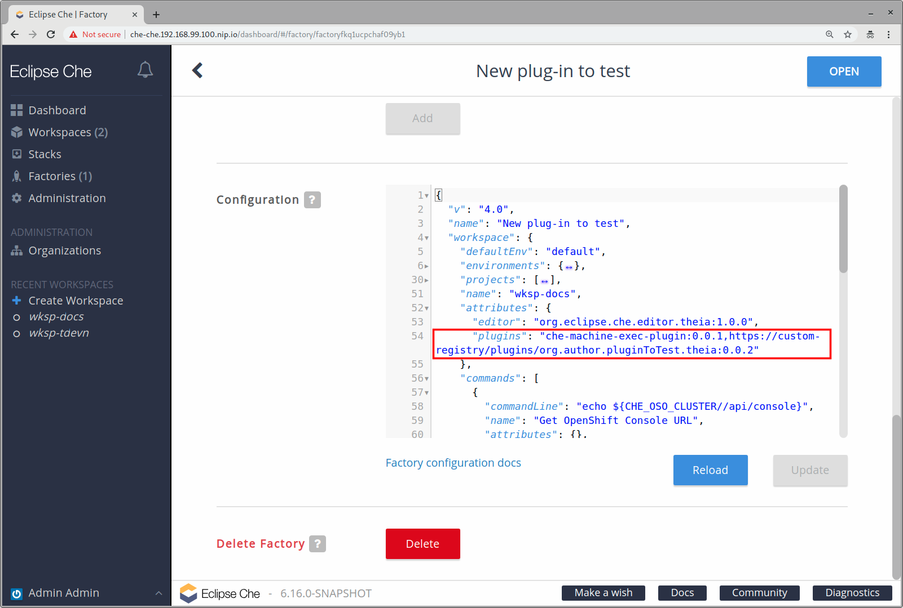

Then just share the factory link.


_Warning: accept factories only from trusted sources. Malicious factories could steal data accessible from within workspace (TODO move to factories section?)._

    *** How to override RAM of a plugin


Sometimes plugins consume more memory than it was allocated for the plugin by plugin author or Che defaults. An example of such a case is Language servers usage with project that has a lot of source files (dozens of southands). RAM consumption in such a case should be tuned, otherwise Linux machine that runs Che workspaces will kill process with out of memory error (OOM). 

When such a situation happen user can override RAM limit for a particular plugin in theirs workspace configuration.

To do that set workspace attribute `sidecar.<plugin ID goes here>.memory_limit` with value `1000M` or `10Gi` or any other value consisting of number and suffix `b, k, ki, m, mi, g, gi` or without suffix ar all which would stand for the number of bytes as RAM limit. With this notation suffixes that contain character “i” means that it is number of power of 2, like 1024 in contrast to numbers that use power of 10 like 1000.

Example of an attribute that sets RAM limit for YAML language server plugin https://github.com/eclipse/che-plugin-registry/blob/master/plugins/redhat.vscode-yaml/0.3.0/meta.yaml[https://github.com/eclipse/che-plugin-registry/blob/master/plugins/redhat.vscode-yaml/0.3.0/meta.yaml] to 768 mebibytes (1073741824 bytes):

```

`“attributes”: {`

`“Sidecar.redhat.vscode-yaml.memory_limit”: “768mi”`

`}`

```


  ** Plug-ins Contribution Points [Mykola]


Beside using API methods and events each plug-in may bring into Theia new components. They could be visual like panels, menus, etc., but also they could add language servers, debuggers and other stuff. Mechanism of adding additional components into Theia is done via contribution points. Contribution point is a section in Theia plug-in configuration into which meta-information about new components is expected to be added. Below is the full list of available contribution points in Theia.


    *** List of all the contributions points [Mykola]


_Grammars_

This section provides syntax highlight rules for specified file types.

To add some syntax highlighting into Theia with help of plug-in, it is required to add a record which describes new grammar into `contributes.grammars` section of plug-in package.json file. An example of a gramma record is given below.


.package.json of plug-in

```json
"grammars": [
+
  {

    "language": "lang",
+
    "scopeName": "text.ext",
+
    "path": "./path/to/lang.tmLanguage.json"
+
  }
+
]

```


where `language` specifies the language to which this syntax highlight should be applied. `scopeName` and syntax highlighting rules from json file by `path` is TextMate scope name and grammar. See https://macromates.com/manual/en/language_grammars[TextMate docs] for more details about them.

Also full example could be found https://github.com/eclipse/che-theia-samples/tree/master/samples/xml-language-server-plugin[here].


_Preferences (configuration) [Oleksii K]_

A plug-in could introduce some new preferences.

They could be defined within `"configuration"` which is sub-section of `"contribution"` in `package.json`. A preference should be contributed as a JSON schema. JSON schema describes what is actually contributed and allows user to get support when editing settings in Preferences Editor.


This is an example of configuration contribution for a plug-in preference which defines logging level:


````json`
{
   "contributes": {
       "configuration": {
           "type": "object",
           "title": "A plug-in configuration",
           "properties": {
               "myPlugin.logLevel": {
                   "type": "string",
                   "default": "error",
                   "description": "Plug-in logging level"
               }
           }
       }
   }
}
```


As for now there are three scopes of preferences defined in Theia:

* *default* scope consists of values which are defined in `"configuration"` sub-section of `package.json`. These are default values of a preferences contributed by a plug-in.
* *global* or *application-wide* scope values could be set in User Preferences. They override the default ones.
* *workspace* scope values, which are applied only when Theia workspace is opened and override default and global values. They could be set in Workspace Preferences.


A user can easily get preferences using `theia.workspace.getConfiguration(section)`. If `section` is defined only that subset of preferences is returned.


For example:


````javascript`
// all preferences contributed by a plug-in
theia.workspace.getConfiguration('myPlugin'); // { "logLevel": "error" }

// or
theia.workspace.getConfiguration().get('myPlugin'); // { "logLevel": "error" }

// or, `logLevel` value:
theia.workspace.getConfiguration().get('myPlugin').get('logLevel'); // "error"
```


Plug-in API allows to update preferences as well:


````javascript`
const pluginPrefs = theia.workspace.getConfiguration('myPlugin');
pluginPrefs.update('logLevel', 'debug', theia.ConfigurationTarget.User);
```


Someone may need to get all information about a configuration setting. Method `inspect` returns an object which consists of *default*, *global* and *workspace* (if exists) values of a preference key:


````javascript`
pluginPrefs.inspect('logLevel');
// {
//     "key": "myPlugin.logLevel",
//     "defaultValue": "error",
//     "globalValue": "debug"
// }
```


_View containers_

View container is a container which holds #bookmark=id.kzpe4ssojtnu[views]. In Theia they are usually represented as panels. All view containers is divided in 3 sections: `left`, `bottom` and `right`. Position of view container is depends on the section to which it belongs. But it defines only default position of the view container which could be changed in runtime via drag and drop.

To add a view container into Theia, it is enough to add appropriate record into plug-in `package.json`. `viewsContainers` section is located under `contributes` section and holds view container sections in which information about view container itself should be placed. It is shown in the following snippet:


```json
"contributes": {
   "viewsContainers": {
     "bottom": [
       {
         "id": "view-container-id",
         "title": "The title"
       },
       {
         "id": "another-view-container-id",
         "title": "Some title"
       }
     ],
     "right": [
       {
         "id": "view-container-on-the-right-side-id",
         "title": "Panel on the right"
       }
     ]
   }
}
```

Each view container has 3 fields in its definition:

* `id`  - identifier of the view container. Is used to attach #bookmark=id.kzpe4ssojtnu[views] into this view container.
* `title` - text which will be displayed on the panel tab.
* `icon` (optional) - has no effect, reserved for future.

Note, view container has no much sense without #bookmark=id.kzpe4ssojtnu[views] in it.


Full example could be found https://github.com/eclipse/che-theia-samples/tree/master/samples/tree-view-sample-plugin[here].


_Views_

View is a visual component which should be placed into a #bookmark=id.awz2zn7wppzk[view container].

To add a view into Theia it is required to add appropriate record into `contributes.views` section of plug-in `package.json`. Each view is represented by simple object with only two fields:

* `id` - view identifier
* `name` - name of view which will be displayed as widget title inside #bookmark=id.awz2zn7wppzk[view container].

Each view description should be included into a section inside `views` contribution where section name should be the same as view container id. Example:


```json
"viewsContainers": {
    "left": [
        {
          "id": "view-container-id",
          "title": "The title"
        }
    ],
},
"views": {
    "view-container-id": [
        {
          "id": "tree-at-left-side",
          "name": "A list"
        },
        {
          "id": "widget-at-left-side",
          "name": "A widget"
        }
    ]
}
```


Currently, as a view widget, only tree view is supported.

For more details see full example https://github.com/eclipse/che-theia-samples/tree/master/samples/tree-view-sample-plugin[here].


_Menus_

Plug-ins may add new menu items into Theia via `contributes.menus` section in plug-in `package.json`. `menus` section consists of menus names and menu items in them. Example:


```json
"menus": {
    "editor/context": [
        {
            "command": "my.command.id",
            "group": "custom.group",
            "when": "view == widget-at-left-side && config.namespace.property"
        },
        {
            "command": "core.about"     
        }
    ],
    "explorer/context": [
        {
            "command": "other.command.id",
            "group": "some.group"
        }
    ]
}
```


where

* `command` - identifier of Theia command which will be executed when the menu item used. The handler receives currently selected resource as first argument.
* `group` (optional) - name of group in menu to which this command will be added. This field is optional and might be omitted. In that case the menu item will be added to common group in the specified menu.
* `when` (optional) - condition which defines when this menu item should be shown (visible). If this property is omitted then the menu item will be always visible. Conditions are the same as in https://code.visualstudio.com/docs/getstarted/keybindings#_when-clause-contexts[VSCode when clause].


Menus which support extending:

* `explorer/context`
* `editor/context`
* `editor/title`
* `debug/callstack/context`
* `view/item/context`

Plug-in example which contributes menu items contribution could be find https://github.com/eclipse/che-theia-samples/tree/master/samples/menus-contribution-plugin[here].


_Key bindings_

Plug-ins may add new shortcuts or redefine existing. It could be done just by describing new shortcut under `contributes.keybindings` section of plug-in `package.json`. Each key bonding is described by 3 values:

* `key` - defines key combination for this shortcut. https://code.visualstudio.com/docs/getstarted/keybindings#_keyboard-rules[Rules for defining key combinations] are the same as for VSCode.
* `command` - identifier of command which should be invoked when the shortcut is pressed.
* `when` (optional) - condition which defines when this shortcut should be available. If omitted, the shortcut is always available. Conditions format is the same as in https://code.visualstudio.com/docs/getstarted/keybindings#_when-clause-contexts[VSCode when clause].


Example:


```json
"keybindings": [
     {
         "key": "ctrl+b",
         "command": "ts.compile",
         "when": "resourceExtname == .ts"
     },
     {
         "key": "ctrl+f alt+b",
         "command": "some.command"   
     }
]
```


Note, that `ctrl+f alt+b` defines chord, i.e. the command will be invoked after pressing both combination one after the other.


_Debuggers_

It is possible to add new debuggers via plug-ins. It could be done via implementing https://microsoft.github.io/debug-adapter-protocol/[Debagger Adapter Protocol] (DAP) for specific debugger. Then the debugger should be registered in `contributes.debuggers` section of plug-in `package.json`.

Adding a new debugger is not a trivial thing and there is a #bookmark=id.aecox7xya36q[dedicated section] for that.

You may use https://microsoft.github.io/debug-adapter-protocol/implementors/adapters/[list of debuggers] from official DAP site as a reference and samples.


_Languages (Language Servers)_

_Please note, this is experimental approach and it could be changed in future._

To add a language server into Theia via plug-in it should be described in `contributes.languages` section of plug-in package.json.


```json
"languages": [
+
    {
+
      "id": "lang",
+
      "aliases": [
+
        "Lang",

        “LANG”
+
      ],
+
      "extensions": [
+
        ".ext"
+
      ],
+
      "firstLine": "^#!/.*interpreter",
+
      "configuration": "./language-configuration.json"
+
    }
+
]

```


where

* `id` - is the id of language for which the language server is made
* `aliases` - another names for the language
* `extensions` - specifies files by extension for which this language server is added
* `firstLine` - specifies files by hashbang for which this language server is added
* `configuration` - path to json with language configuration (TODO our section or just link to https://code.visualstudio.com/api/language-extensions/language-configuration-guide[VSCode docs] ???? )


When that is done, it is required to register the language server. It could be reached using following API call:


```typescript
theia.languageServer.registerLanguageServerProvider(xLanguageServerInfo);
```


Where `xLanguageServerInfo` is an object of `theia.LanguageServerInfo` and should contain following fields:

* `id` - language id, should be the same as `id` in the configuration json file
* `name` - human readable name of the language server
* `globPatterns` - file pattern which specifies files for which this language server is added
* `command` - the language server start executable
* `args` - arguments for the language server start executable

After the command above is invoked language server should be started.


See full example https://github.com/eclipse/che-theia-samples/tree/master/samples/xml-language-server-plugin[here].


_Web View API_

Web view API is not a contribution point by definition, but it behaves like it and allows to bring a lot of new stuff into Che Theia. Using web view API plug-ins may add custom contents into Theia. It could be custom UI, graphical data or anything what could be displayed in a web page.

Actually web view API provides iframe to which plug-in has access.

To create an instance of web view there is `createWebviewPanel` function:


````typescript`
const webViewPanel = theia.window.createWebviewPanel('webViewId', 'Title',  theia.ViewColumn.One);
```


Then some content could be added:


```typescript
webViewPanel.webview.html ='<html><body><h1>Hello from web view</h1></body></html>';
```


But there is one important note. The web view content gets destroyed once it becomes hidden. To quickly restore state one may register serializer or this behaviour could be changed by setting `retainContextWhenHidden` option for the web view, but despite this option when web view gets hidden all scripts will be paused and won’t be able to process messages from plug-in.

Current state of web view could be read from web view panel object.

Of course, one may load resources and scripts into web view and communicate with plug-in via posting messages. See full https://github.com/eclipse/che-theia-samples/tree/master/samples/webview-sample-plugin[sample plug-in] for more details.


    *** Link to API reference for developer [Mykola]

Che Theia plug-in API consists of two namespaces:

* `theia` namespace - provides Theia IDE related API which allows to interact with its different components.
* `che` namespace - provides plug-in API to access some Che API


_`theia` namespace_

All available resources of `theia` namespace is described in https://github.com/theia-ide/theia/blob/master/packages/plugin/src/theia.d.ts[`theia.d.ts` file] in the https://github.com/theia-ide/theia[Theia repo]. The root of the namespace contains types declaration and API sections. They are listed below:

* commands - contains API for adding new and executing existing Theia commands.
* debug - some debugger events and API for debugger configuration.
* env - API for accessing environment variables and query parameters of Theia IDE
* languages - contains API and events related to support of a language. Typically is used by language servers.
* languageServer (experimental) - API for language servers integration.
* plugins - API for retrieving information about loaded plug-ins
* tasks - API for providing custom tasks runners
* window - contains API to control visual components of the IDE. It allows to manipulate with editor tabs, terminals, status bar, etc. Contains events for changing state of some components and whole IDE . Also all dialog popup’s is placed here. 
* workspace - APIs related to Theia workspace. Contains information about current workspace state, documents in it, files related operation like watching, finding, etc. Contains events about state change.


_`che` namespace_

_Please note, many APIs in the namespace are experimental and could be changed in future._

All available resources of `che` namespace is described in `https://github.com/eclipse/che-theia/blob/master/extensions/eclipse-che-theia-plugin/src/che.d.ts[che.d.ts]`  file in the https://github.com/eclipse/che-theia[Che-Theia repo].

This namespace contains APIs and types which are related to Che. Some sections are just a bridge to some #bookmark=id.nk1l8p5bmmsp[Che API]. List of sections:

* factory - allows to work with Che factory API. Provides functionality to retrieve specified factory configuration.
* task - allows to contribute Che aware commands (i.e. Che specific attributes like workspace id or container name are accessible from within task implementation)
* variables - allows to contribute variable resolver.
* workspace - allows to work with Che workspace API. Provides functionality to access workspaces, their lifecycle and user settings.


_How to use `che` namespace in plug-ins_

* Backend plug-in

Add `@eclipse-che/plugin` dependency into plug-in `package.json` and just import and use it. For example:

```typescript
import * as che from '@eclipse-che/plugin';

const wsConfig = che.workspace.getById(workspaceId);
```

* Frontend plug-in

For frontend plug-in it is the same as for backend, but also requires modification of `externals` section in `webpack.config.js` by adding `@eclipse-che/plugin` key with following value: `che.<your_plugin_id>` (it can be copied from `@theia/plugin` value with replacing `theia.` to `che.`).

For example:


```javascript
externals: {
+
   "@theia/plugin": "theia.theia_test_api",
+
   "@eclipse-che/plugin": "che.theia_test_api"
+
 }

```


Note, it is possible to add new API namespace for plug-ins via separate extension.


* *Extending How-To Guides*
  **  P1 How to Add Support for a New Language
  **  P1 How to Add Support for a New Debugger
  ** How to package a VSCode plug-in for Eclipse Che

https://github.com/eclipse/che/wiki/CHE-7---Development-Workflow[https://github.com/eclipse/che/wiki/CHE-7---Development-Workflow]


  **  P1 How to provide a “custom IDE” based on Eclipse Theia
  ** How to add a new UI component to the editor
  **  P1 How to switch the default editor from Che, to another one


*  P1 *API Reference*
  ** Access to Swagger
    *** General APIs
    *** WSAgent APIs
  ** Workspace API
  ** Permissions API
  ** Factory API
  ** Resources API
  ** IDE Macros


*  P1 *Extensibility Reference*
  ** Infrastructure SPI
  ** Eclipse Theia Plug-ins API
  ** Language Server Protocol
  ** Debug Adapter Protocol


    *** Developing a real world plug-in [Vitaliy]


Once you have learned the basics of Theia Plugin API, it’s time to build a real-world plugin. Good and a simple example is https://github.com/eclipse/che-theia-samples/tree/master/samples/opened-editor-list[opened-editors-list] plugin from our samples. Let’s write it from scratch.

_First sketches_

The first step is generate a simple `opened-editors-list` frontend plugin using `Yeoman Wizard`. Then open `opened-editors-list-frontend.ts` and add import of Theia plugin API.


|===
| ````javascript`import * as theia from '@theia/plugin';```  
|===


+


Next is add handlers on the opening and closing the documents.


|===
| ````javascript`// here we will store URIs of opened documentsconst openedEditors = new Set<theia.Uri>();export function start(context: theia.PluginContext) {    theia.workspace.onDidOpenTextDocument(e => {        openedEditors.add(e.uri);        theia.window.showInformationMessage(`Opened ${e.uri}`);    });    theia.workspace.onDidCloseTextDocument(e => {        openedEditors.delete(e.uri);        theia.window.showInformationMessage(`Closed ${e.uri}`);    });}```  
|===


Now is the time to try your plugin in hosted Theia and see how it handles the actions. 
+
You already know how to build the plugin and what is self hosting. Just open terminal in `ws/dev` container, go to plugin directory `cd /projects/opened-editors-list` and build the plugin by `yarn` command. Then press F1, find and run `Hosted Plugin: Start Instance` command, select your plugin and click ‘Open’. When the new window opens, try open and close any document to ensure the handlers are working.


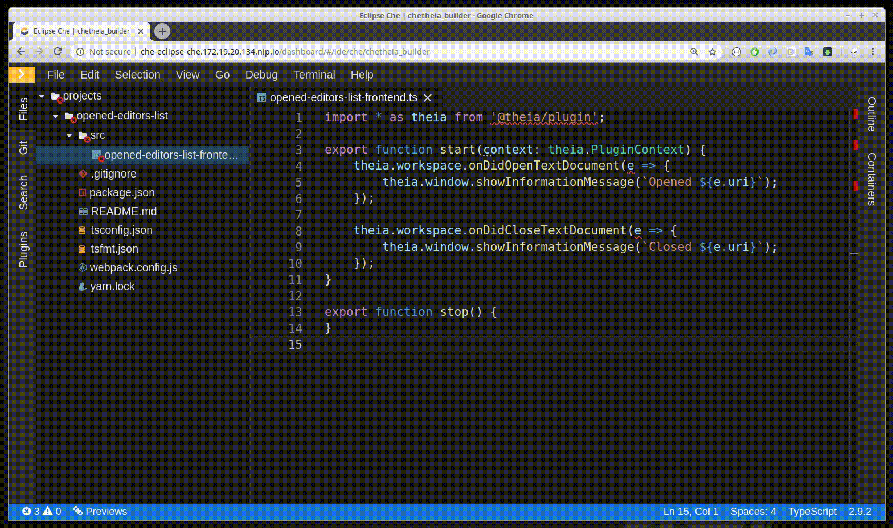


_Editors side panel_

To add `Editors` panel we need to create a view. Plugin API describes that views can be embedded only to view containers. So, the first we need to add a view container and then view. Views and view containers described in `Plugin Contribution Points` section.

Let’s add the panel right now. For that open `package.json`, scroll down and add `contributes` section. In this section we have to describe `viewsContainers` and `views` sections. In `viewContainers` section we have to set the destination for the view container and specify `id` and `title`. In `views` section we have to describe our view in format `view-container-id`: [ { view id, view name } ].

As a result, we should have following


|===
| ````json`    "contributes": {        "viewsContainers": {            "right": [                {                    "id": "editors",                    "title": "Editors"                }            ]        },        "views": {            "editors": [                {                    "id": "opened-editors",                    "name": "Opened Editors"                }            ]        }    }```  
|===


Now you have to restart hosted Theia to have `Editors` panel opened.

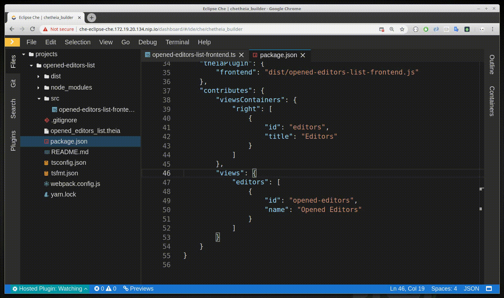


_List of editors_

Now let’s display the list of editors. For this we can use tree view and display only root nodes, so tree will look like a simple list.

To display tree view we have to do following:

* create data provider
* create tree view
* update the tree when opening or closing the editor

	The first we need to create tree data provider. See the https://github.com/theia-ide/theia/blob/master/packages/plugin/src/theia.d.ts#L3212[API declaration] for details. 
+
	


Let’s create a class `OpenedEditorsDataProvider` which is implemented `theia.TreeDataProvider`. We must parametrize tree data provider by the type we are going to operate. In our case it’s `theia.Uri`. Also we have to implement mandatory `getChildren` and `getTreeItem` methods.

`getChildren` returns children for the given element. When the given element is null, it means that list of root element must be returned. In our example tree view will display only root elements, so we can always return a list of the elements and don’t pay attention on the given parameter.

`getTreeItem` must return tree item for the give element. In our case we provide only label and icon for tree item. It is enough to display tree items as single note.

Let’s move forward and add `onDidChangeTreeData` event. This optional event is used to notify that tree has changed and needs to be reloaded. `onDidChangeTreeDataEmitter` is needed to fire an event, `onDidChangeTreeData` returns an event of the emmiter. In our case we have to add some `sendDataChanged` function which we will call from our plugin and which will fire change event.

As a result, we will have the following


|===
| ````javascript`export class OpenedEditorsDataProvider implements theia.TreeDataProvider<theia.Uri> {    private onDidChangeTreeDataEmitter: theia.EventEmitter<any> = new theia.EventEmitter<any>();    readonly onDidChangeTreeData: theia.Event<any> = this.onDidChangeTreeDataEmitter.event;    public sendDataChanged() {        this.onDidChangeTreeDataEmitter.fire();    }    getTreeItem(element: theia.Uri): theia.TreeItem | PromiseLike<theia.TreeItem> {        let name = element.path.substring(element.path.lastIndexOf('/') + 1);        return {            label: name,            iconPath: 'fa-sticky-note medium-red',            tooltip: element.path        };    }    getChildren(element?: theia.Uri | undefined): theia.ProviderResult<theia.Uri[]> {        return [...openedEditors];    }}```  
|===


Then we need to create data provider instance and create tree view. For the tree view we have to specify the tree view ID and the data provider.


|===
| ````javascript`let openedEditorsDataProvider: OpenedEditorsDataProvider;export function start(context: theia.PluginContext) {treeDataProvider = new OpenedEditorsDataProvider();theia.window.createTreeView('opened-editors', { treeDataProvider: treeDataProvider });		...	}```  
|===


Don’t forget to handle opening and closing the documents. We need to update `openedEditors` list and inform the data provider that opened editors list has been changed. Also it would be nice to highlight the active editor in the tree view. For that we can listen `theia.window.onDidChangeActiveTextEditor` event and reveal tree item when changing the editor.


|===
| ````javascript`    theia.workspace.onDidOpenTextDocument(e => {        openedEditors.add(e.uri);        openedEditorsDataProvider.notifyDataChanged();    });    theia.workspace.onDidCloseTextDocument(e => {        openedEditors.delete(e.uri);        openedEditorsDataProvider.notifyDataChanged();    });    theia.window.onDidChangeActiveTextEditor(e => {        if (e) {            treeView.reveal(e.document.uri, {                select: true            });        }    });```  
|===


Now let’s switch to the hosted Theia and refresh the page

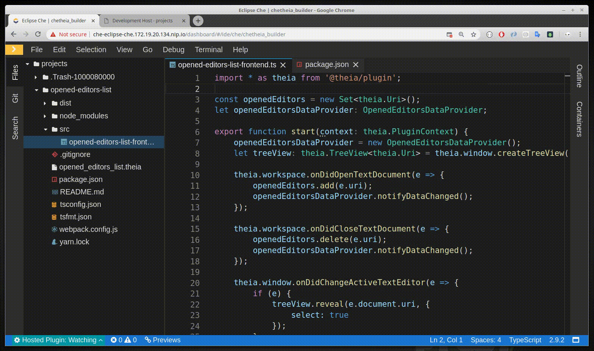


    *** Developing a real world plug-in for Che [Vitaliy]


Hope you already have an experience with writing plugin using Theia Plugin API.
+
Now the time to write next one for Che using Che Plugin API.


We have a good example working plugin
+
https://github.com/eclipse/che-theia/tree/master/plugins/containers-plugin[https://github.com/eclipse/che-theia/tree/master/plugins/containers-plugin]


Let’s give a look at containers plugin and write something like it.

Steps to do:

* ensure your Theia supports Che API;
* generate Hello World plugin;
* add dependency on Che API api;
* get current workspace config;
* add Che-Containers panel;
* show workspace containers.


_Ensure your Theia supports Che API_

To run plugins that use Che API your Theia must include `theia-plugin-ext` extension which provides the implementation of Che API. To ensure the extension exists in your Theia go to Help > About and find `@eclipse-che/theia-plugin-ext` in the list of extensions.

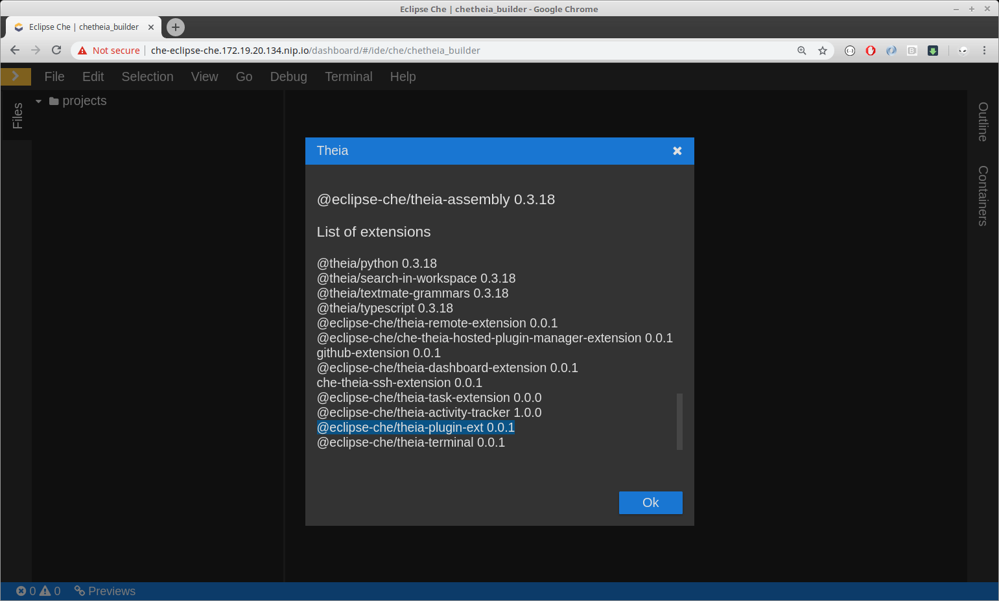


_Generate Hello World plugin_

Now using `Yeoman Wizard` generate frontend `Hello World plug-in` and name it `che-sample-plugin`. When generating finished you will get the built plugin which is ready to run in hosted Theia.


_Add dependency on Che API api_

Next step is to add the dependency on the Che API. For that open package.json and dependencies on `@eclipse-che/api` and `@eclipse-che/plugin` to `devDependencies` section. `@eclipse-che/api` provides Che interfaces like Workspace, Machine, Factory. Those interfaces are also used in Che Plugin API declarations `@eclipse-che/plugin` and in the Che Plugin API implementation.


|===
| ````json`devDependencies {+    ...+    "@eclipse-che/api": "^6.16.1",    "@eclipse-che/plugin": "latest",+    ...+}```  
|===


In our case we are writing frontend plugin and also have to add `@eclipse-che/plugin": "che.theia_che_sample_plugin` in externals. This external creates a webworker part of Che plugin API implementation and binds it with your plugin. If you don’t add this external, your plugin will be loaded and started but the API will not be accessible.

Externals section should be like following


|===
| ````json`externals: {    "@theia/plugin": "theia.theia_che_sample_plugin",    "@eclipse-che/plugin": "che.theia_che_sample_plugin"}```  
|===


_Get current workspace config_

Let’s start from getting configuration of the current workspace and displaying list of containers. The first we have to add import of `@eclipse-che/plugin`. It’s the dependency on declaration of Che Plugin API namespaces and methods. Also we have to add import of Che API `@eclipse-che/api`. It contains declaration of Che API interfaces.


|===
| ````javascript`import * as che from '@eclipse-che/plugin';import { che as cheApi } from '@eclipse-che/api';```  
|===


Imports are there, the next is getting the workspace and printing something to the output. We can take the workspace using `che.workspace` namespace of the API. Just see how can we fetch it in one line.


|===
| ````javascript`try {    let workspace = await che.workspace.getCurrentWorkspace();} catch (e) {    theia.window.showErrorMessage('Unable to get current workspace');}```  
|===


If you use `async / await` when calling workspace methods you have to ensure all fails be handled properly.

As we noticed above, Theia supports code completion. You will get list with proposals when accessing to `che.` or to `che.workspace.` or to another part of Che API.

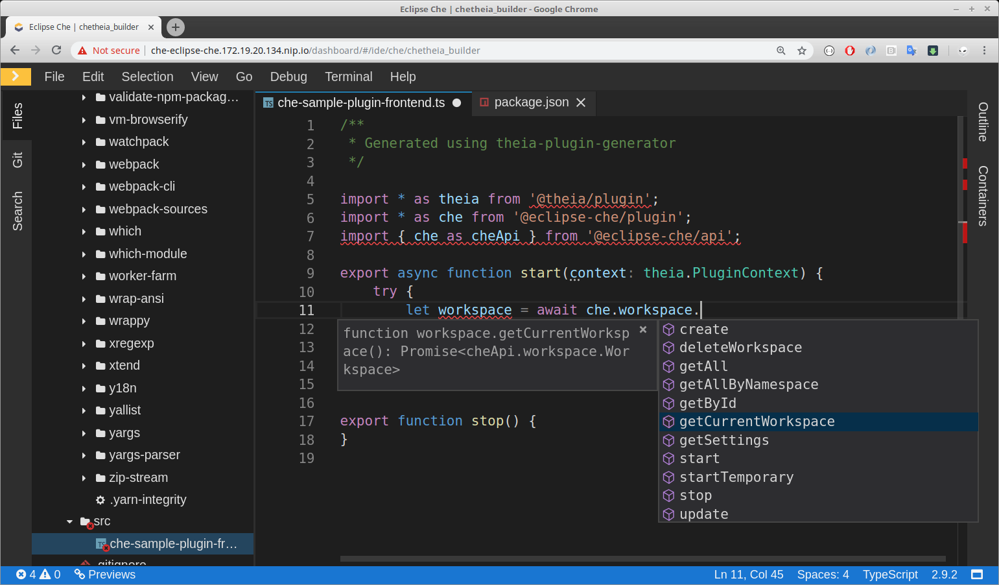

Let’s add the output and print workspace name and list of machines with memory limitations. For this we can add `printWorkspaceInfo(ws: cheApi.workspace.Workspace)` function. This function receives a workspace, creates an output channel and prints the workspace info. Below is an example


|===
| ````javascript`export async function start(context: theia.PluginContext) {    try {        let workspace = await che.workspace.getCurrentWorkspace();        printWorkspaceInfo(workspace);    } catch (e) {        theia.window.showErrorMessage('Unable to get current workspace');    }}function printWorkspaceInfo(ws: cheApi.workspace.Workspace) {    // create and display output    var out = theia.window.createOutputChannel('Workspace');    out.show(true);    // print workspace name    out.appendLine('Workspace: ' + ws.config!.name!);    out.appendLine(' ');    // foreach machines (containers)    Object.keys(ws.runtime!.machines!).forEach(name => {        // get machine        let machine = ws.runtime!.machines![name];        // get memory limit        let memLimit: number = Number.parseInt(machine.attributes!['memoryLimitBytes']);        memLimit /= 1024 * 1024 * 1024;        // print machine name and memory limitation in gigabytes        out.appendLine('    > Machine: ' + name! + '  Size: ' + memLimit.toFixed(1) + 'GB');        out.appendLine(' ');    });}```  
|===


Now we can build our plugin and run it in hosted Theia. To build the plugin we have to open terminal in `ws/dev` container, go to plugin directory `/projects/che-sample-plugin` and run `yarn`. Then when build has been finished, press `F1`, find and run command `Hosted Plugin: Start Instance`. In the popup we need to select path to our plugin and click `Open`.

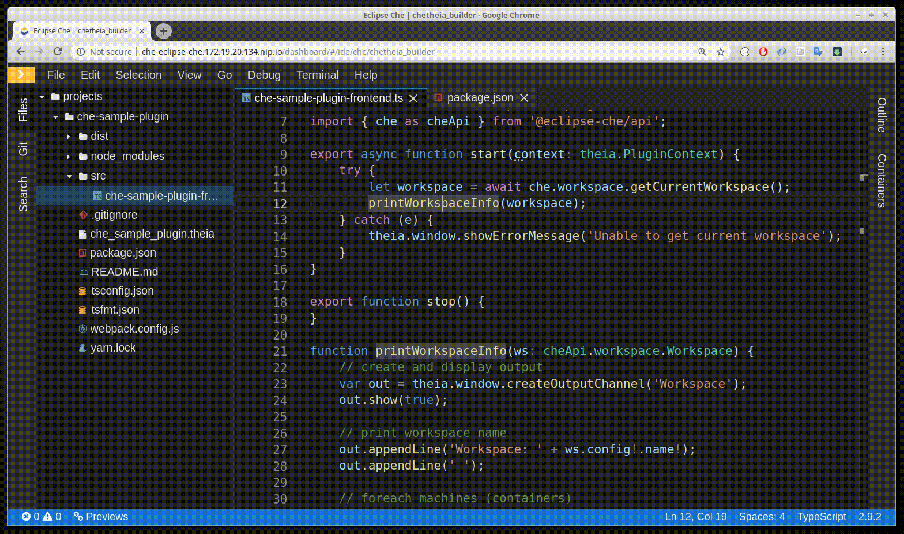


_Add Che-Containers panel_

Now let’s display a list of containers in dedicated side panel. Also we can add click handler to the list and open a terminal in the selected container.

To display list of containers we will use tree view which can be shown inside view container. View container is a side panel containing several views. In our case we will add view container displaying only one view.

Open `package.json`, create `contributes` section, if it does not exist, and then add view container and view like following


|===
| ````json`    "contributes": {        "viewsContainers": {            "right": [                {                    "id": "workspace",                    "title": "Workspace"                }            ]        },        "views": {            "workspace": [                {                    "id": "che-workspace",                    "name": "Che Workspace"                }            ]        }    }```  
|===


To add view container we have to specify target for the container. Possible values are: `left`, `right` and `bottom`. Target contains a list of containers, each of which must have `id` and `title`. When you add only `viewsContainers` section, you will have an empty `Workspace` panel opened and nothing will be displayed.

To add the view we need to add `views` section. In this section we need specify the container ID ("workspace") in which we are going to add our view, and then specify a list with views. Each view must have `id` and `name`.

Now we need to restart hosted Theia to see the result.

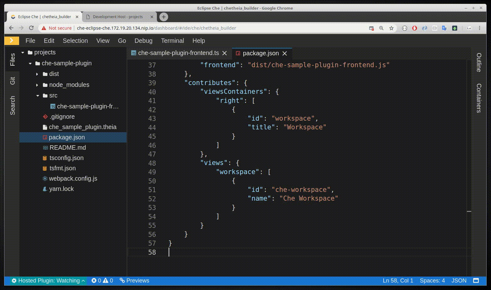


Show workspace containers

To show containers of the workspace we will use Tree View. We already have an empty `Workspace` view container with one `Che Workspace` view. Now let’s add a tree view.

To show a Tree View the first we need to create `TreeDataProvider`. Let’s start from it and creatre `CheWorkspaceTreeDataProvider` implementing `theia.TreeDataProvider`. We have to parametrize the data provider with a type we are going to operate. For this example `string` is enough. Next step is implementing two mandatory methods: `getChildren` and `getTreeItem`.

`getChildren` should return children for the given tree element. In this example we will display a two-level tree.


|===
| ````javascript`getChildren(element?: string | undefined): theia.ProviderResult<string[]> {    if (!element) {        return [this.workspace.config!.name!];    }    var machines: string[] = [];    Object.keys(this.workspace.runtime!.machines!).forEach(name => {        machines.push(name);    });    return machines;}```  
|===


When the element is `undefined`, it means that we have to return root nodes. In our sample we return an array containing only workspace name. After receiving the root, tree will ask the data provider for the children. Here we don’t do any checks and just return a list of containers. In the workspace runtime containers are called machines, so let use the original name.  

The next is implementing of `getTreeItem`. This method must create `theia.TreeItem` for the given element. In fact, it provides data for visual representation of the node. In the example below we provide two types of tree nodes: for workspace and for container.

The first is workspace node. It has only label, icon and collapsible state. This state indicates the node has children and should be displayed expanded or collapsed. For the icon we support icons from ‘Font Awesone’, so you can use any icon you like.

For the container node we specify label, icon, tooltip and command. If tree item has a command, this command will be executed when the tree node become selected.

Theia in Che has registered commands to open Terminal in specific container. In this example we specify ID of those commands as a field for the tree item.


|===
| ````javascript`getTreeItem(element: string): theia.TreeItem | PromiseLike<theia.TreeItem> {    if (this.workspace.config!.name! === element) {        return {            label: element,            iconPath: 'fa-cloud medium-yellow',            collapsibleState: theia.TreeItemCollapsibleState.Expanded        }    }    return {        label: element,        iconPath: 'fa-cube light-green',        tooltip: `Click to open terminal for ${element}`,        command: {            id: `terminal-for-${element}-container:new`        }    }}```  
|===


As result we have to have this TreeDataProvider.


|===
| ````javascript`export class CheWorkspaceTreeDataProvider    implements theia.TreeDataProvider<string> {    constructor(protected workspace: cheApi.workspace.Workspace) {    }    getTreeItem(element: string): theia.TreeItem | PromiseLike<theia.TreeItem> {        if (this.workspace.config!.name! === element) {            return {                label: element,                iconPath: 'fa-cloud medium-yellow',                collapsibleState: theia.TreeItemCollapsibleState.Expanded            }        }        return {            label: element,            iconPath: 'fa-cube light-green',            tooltip: `Click to open terminal for ${element}`,            command: {                id: `terminal-for-${element}-container:new`            }        }    }    getChildren(element?: string | undefined): theia.ProviderResult<string[]> {        if (!element) {            return [this.workspace.config!.name!];        }        var machines: string[] = [];        Object.keys(this.workspace.runtime!.machines!).forEach(name => {            machines.push(name);        });        return machines;    }}```  
|===


The next is initializing the data provider and creating the tree view.


|===
| ````javascript`export async function start(context: theia.PluginContext) {    try {        let workspace = await che.workspace.getCurrentWorkspace();        printWorkspaceInfo(workspace);        theia.window.createTreeView('che-workspace', {            treeDataProvider: new CheWorkspaceTreeDataProvider(workspace)        });    } catch (e) {        theia.window.showErrorMessage('Unable to get current workspace');        return;    }}```  
|===


When creating a Tree View we need to pass the tree view ID as it specified in `package.json`.

Now we can switch to hosted Theia and just refresh the page. Considering watcher for code changes is running and toolbar item ‘Hosted Plugin: Watching’ is displayed, the changes should be applied immediately.

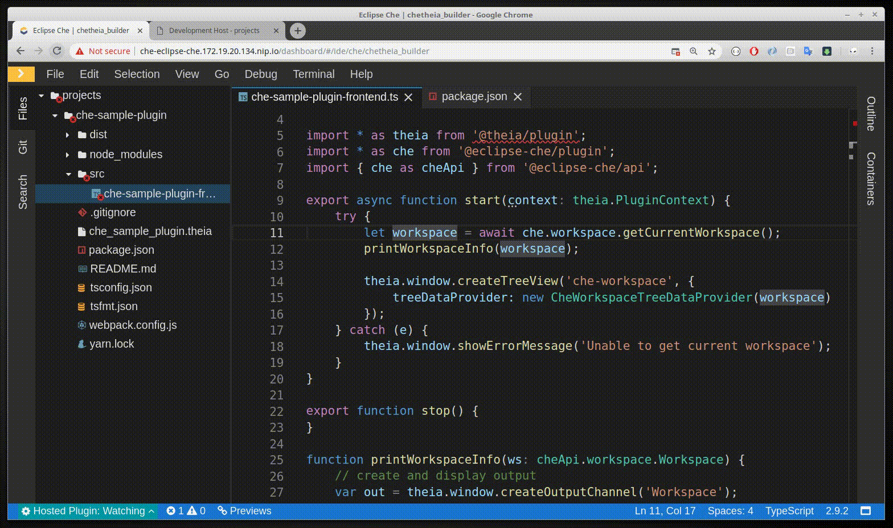


Architectural insights about the plugin brokers [Ilya Buziuk]

